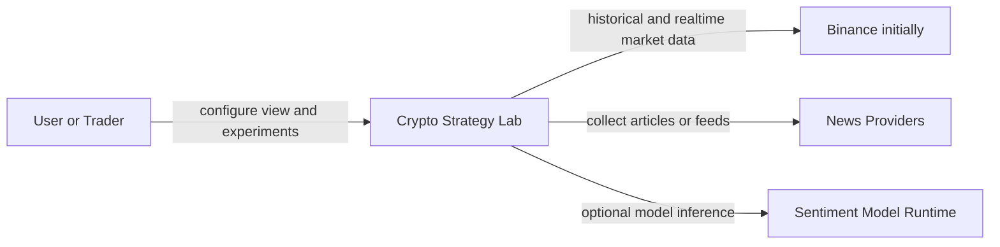
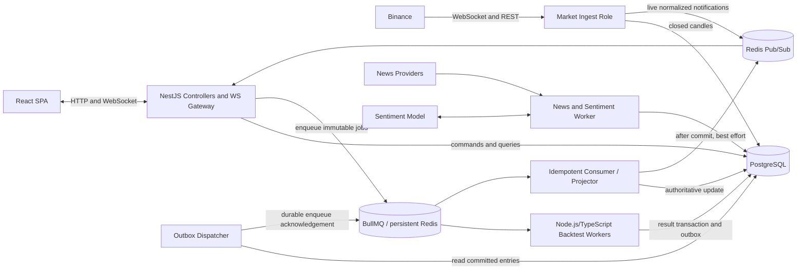

# Crypto Strategy Lab Architecture Proposal

Architecture Status: ACCEPTED FOR FROZEN BASELINE v1.1
Validation Status: PENDING IMPLEMENTATION PROOFS
Decision date: 2026-08-21
Traceability convention: `P-*` problem, `QA-*` quality scenario, `D-*` decision, `ADR-*` record, `ARC-*` architecture element, `PROOF-*` validation proof.

**Diagram-first guide:** start with the [diagram index](../diagrams/README.md), [Problem Tree](../diagrams/01-problem-tree.md), and [Decision Tree](../diagrams/02-decision-tree.md). These diagrams summarize this reasoning without replacing it.

Baseline v1.1 preserves the v1 architecture reasoning and supersedes only its technology realization and the clarified delivery/result-acceptance semantics. The exact frozen v1 baseline remains at [`architecture-baseline-v1.md`](architecture-baseline-v1.md).

## 1. Purpose and scope

This proposal preserves the reasoning from the supplied sources to a concrete implementation architecture. It covers repository governance, system boundaries, responsibilities, contracts, runtime communication, data ownership, reproducibility, deployment, technology realization, and proof obligations.

It does not implement application code, database migrations, provider integrations, strategies, backtesting, crawling, ML, or deployment manifests. The result is a frozen implementation constraint, not a running system.

## 2. Source materials

Authority is applied only to what each source actually contains.

| Precedence | Source | Authority used here | Not treated as authoritative |
|---|---|---|---|
| 1 | [`Crypto Strategy Lab - Do an cuoi ky.pdf`](../requirements/Crypto%20Strategy%20Lab%20%E2%80%93%20%C4%90%E1%BB%93%20%C3%A1n%20cu%E1%BB%91i%20k%E1%BB%B3.pdf) | Goals, required modules, MVP, change/failure questions, deliverables | Technology selection, unstated numeric targets, production deployment |
| 2 | [`KienTrucDoAn_slide.pdf`](../requirements/KienTrucDoAn_slide.pdf) | Architecture method, quality scenarios, trade-off framing, candidate patterns | Its explicitly labeled candidate topology or illustrative technologies as mandates |
| 3 | [`sample-ui/`](../requirements/sample-ui/) | Visible layout, labels, and illustrative flows | Business rules, validation, acceptance criteria, numerical defaults |
| 4 | Current primary technology documentation | Evidence that selected tools support the required realization | Project requirements |

The two PDFs were extracted in full and representative requirements, diagrams, MVP, deliverables, architecture-method, trade-off, and ADR pages were visually inspected. The three UI images were visually inspected separately.

## 3. Facts

- **FACT F-01:** The domain uses continuous cryptocurrency market data represented as OHLCV candles across timeframes.
- **FACT F-02:** The required MVP provider is Binance and the system needs both historical and realtime data.
- **FACT F-03:** The dashboard shows up to four charts; each chart's timeframe changes independently without a full-system reload.
- **FACT F-04:** A strategy analyzes a market context and emits a normalized trading signal.
- **FACT F-05:** Composite strategies combine component strategy signals by a defined policy such as majority or weighted voting.
- **FACT F-06:** Candidate generation, backtesting, evaluation, ranking, and leaderboard promotion form a repeatable experiment loop with a stop condition.
- **FACT F-07:** Required evaluation includes return, win rate, maximum drawdown, and trade count; other metrics are optional.
- **FACT F-08:** News collection and sentiment analysis form a pipeline whose normalized output may later participate as a strategy input.
- **FACT F-09:** The assignment emphasizes software architecture and experimental capability, not proof of profitable trading.
- **FACT F-10:** The sources explicitly test change, scale, failure isolation, recovery, duplicate/retry handling, and result provenance.

## 4. Requirements

### Functional requirements

- **REQ-01:** Ingest Binance historical and realtime market data behind a provider boundary.
- **REQ-02:** Display candlesticks and realtime updates for up to four independently subscribed timeframes.
- **REQ-03:** Support at least MA, RSI, Bollinger Bands, and Support/Resistance strategies in the MVP.
- **REQ-04:** Add a new strategy without rewriting the strategy engine or unrelated components.
- **REQ-05:** Define composite strategies and an explicit, versioned combination policy.
- **REQ-06:** Backtest a candidate on identified historical data and produce trades plus required metrics.
- **REQ-07:** Provide at least Random Search and allow the generator to be replaced without changing downstream execution.
- **REQ-08:** Run a controlled search loop with finite stop conditions, user stop, progress, and failures visible.
- **REQ-09:** Maintain and update a Top-K leaderboard and allow sorting or ranking by a defined policy.
- **REQ-10:** Visualize signals, entry/exit, indicators, and support/resistance as applicable; show trade detail.
- **REQ-11:** Collect, normalize, store, and analyze relevant news sentiment through replaceable provider/model boundaries.
- **REQ-12:** Trace a leaderboard entry to the exact materially relevant experiment inputs and versions.
- **REQ-13:** Deliver system-context, deployable/module, responsibility, data-flow, realtime, strategy, and search/backtest architecture documentation plus ADRs.

### Architecture-significant requirements

- **ASR-MOD:** Strategies, generators, providers, combination policies, and sentiment models must be replaceable at their declared boundary.
- **ASR-SCAL:** Candidate execution must scale by adding workers without changing core domain code.
- **ASR-RT:** Realtime updates must not require repeated HTTP polling or full-page reloads.
- **ASR-REL:** Exchange disconnects, duplicate work, worker failure, news failure, and sentiment failure must have explicit recovery/degradation behavior.
- **ASR-MAINT:** Strategy generation, simulation, evaluation, ranking, presentation, and infrastructure must have unambiguous ownership.
- **ASR-OBS:** Loop status, queue depth, job latency, retry/failure counts, provider connection/gaps, and current leader must be observable.
- **ASR-REP:** Completed results must be reproducible and explainable from immutable provenance.
- **ASR-INT:** A partial worker failure must not commit a contradictory mix of trades, metrics, completion status, and events.

## 5. Constraints

- **CONSTRAINT C-01:** Binance is required for the MVP, but its payload shape must not escape its adapter.
- **CONSTRAINT C-02:** The MVP supports a maximum of four chart subscriptions on one dashboard.
- **CONSTRAINT C-03:** The MVP includes the four named technical strategies, composite strategy, historical backtest, minimum metrics, Random Search, Top-K, visualization, and news-to-sentiment pipeline.
- **CONSTRAINT C-04:** The search loop must not be an uncontrolled infinite loop.
- **CONSTRAINT C-05:** Strategy evaluation is separate from strategy implementation.
- **CONSTRAINT C-06:** The source explicitly leaves frameworks, database, broker, ML model, and search technology to the team; no source mandates microservices, Kafka, Kubernetes, CQRS, or Event Sourcing.

## 6. Assumptions

Every item below is a **DESIGN ASSUMPTION**, not a project requirement.

- **A-01 - Initial operating context:** one student team, one logical installation, demo/educational use, and no regulated custody or order execution. Public multi-tenant internet operation triggers architecture review for identity, authorization, abuse controls, and secrets management.
- **A-02 - Workload:** the source's change from small candidate counts to `100,000` is a scale challenge, not a committed throughput target. Proof establishes measured capacity and bottlenecks rather than inventing a deadline.
- **A-03 - Latency:** “realtime/low delay” has no source number. A numeric end-to-end budget must be set during proof-plan calibration before performance acceptance.
- **A-04 - Trade policy:** long/short behavior, capital model, fees, slippage, fill rules, stop loss, take profit, and position sizing are versioned execution configuration. No unstated default is a reproducibility input.
- **A-05 - Ranking policy:** score formula and tie-breaking are versioned policies selected during implementation; architecture does not invent their weights.
- **A-06 - Realtime strategy cadence:** chart transport may carry live candle updates, while each strategy declares the data cadence it consumes. Historical backtests use immutable identified candle data; no live partial value may be silently substituted.
- **A-07 - News/ML:** concrete news sources, crawl technique, language model, and model artifact are replaceable configuration because the sources do not mandate them.
- **A-08 - Delivery:** an initial Docker Compose-style topology is sufficient for repeatable local/demo deployment. Kubernetes is not justified for v1.1.
- **A-09 - Database scale:** one PostgreSQL instance is sufficient initially; module-owned schemas/tables preserve a later split path if measured contention requires it.

## 7. Open questions

These do not block the architecture because the baseline makes them explicit versioned policies or revisit triggers rather than hidden assumptions.

- **OQ-01:** Which exact ranking formula and Top-K tie-break policy will be implemented?
- **OQ-02:** Which initial capital, fee, slippage, fill, and risk rules define the MVP backtest profile?
- **OQ-03:** Which news providers and sentiment model are permitted by license, rate limit, and course constraints?
- **OQ-04:** What measured realtime latency and experiment-throughput targets will be accepted on the demo hardware?
- **OQ-05:** Is authentication required for the final deployment, or is the product a single-operator demo?
- **OQ-06:** What retention policy applies to raw market data, news content, trades, and experiment artifacts?

If an answer changes a boundary, ownership rule, or deployment assumption, the baseline must be reopened. Values within the already defined policy/configuration contracts do not require redesign.

## 8. Problem Tree

```text
P-1 - The system must evolve without ripple changes
|-- P-1.1 Add a strategy without changing backtest, evaluation, ranking, or UI core
|-- P-1.2 Replace Random Search without changing candidate consumers
|-- P-1.3 Add OKX/another exchange without exposing provider payloads to the UI/domain
|-- P-1.4 Replace a news provider or sentiment model independently
`-- P-1.5 Change combination/ranking policy without rewriting strategy implementations

P-2 - Experiment workload can grow and must remain controllable
|-- P-2.1 CPU-heavy backtests must not block realtime/API work
|-- P-2.2 Producer and worker capacity can become imbalanced
|-- P-2.3 Jobs require retry without duplicate committed results
|-- P-2.4 A run requires start, pause, resume, cancel, and finite stop conditions
|-- P-2.5 Worker count must scale without changing core code
|-- P-2.6 Progress, backlog, latency, and failures must be observable
`-- P-2.7 Persistence can become a contention bottleneck

P-3 - Market data is realtime and externally controlled
|-- P-3.1 Four chart subscriptions must remain isolated
|-- P-3.2 Provider disconnect/reconnect must be owned
|-- P-3.3 Missing and duplicate candles must be detected and reconciled
|-- P-3.4 Historical and live data must share one normalized meaning
`-- P-3.5 A provider change must not alter frontend/domain contracts

P-4 - Subsystems and processes fail independently
|-- P-4.1 News failure must not stop charts or technical backtests
|-- P-4.2 Sentiment unavailability must degrade only sentiment-dependent work
|-- P-4.3 Worker failure must not corrupt experiment state
|-- P-4.4 API/WebSocket client failure must not stop ingestion
`-- P-4.5 Duplicate or out-of-order delivery must not corrupt projections

P-5 - Results must be explainable and reproducible
|-- P-5.1 Strategy definition, parameters, and combination policy are versioned
|-- P-5.2 Dataset identity/range/timeframe is fixed
|-- P-5.3 Execution assumptions and engine/build versions are fixed
|-- P-5.4 Search configuration and randomness are fixed where applicable
|-- P-5.5 Sentiment model and preprocessing versions are fixed when used
`-- P-5.6 Leaderboard projection traces to immutable experiment/result records

P-6 - Users must understand current and historical behavior
|-- P-6.1 Realtime state changes without page reload
|-- P-6.2 Search progress and failures are visible
|-- P-6.3 Signals and trades map back to chart time/data
`-- P-6.4 A leaderboard row opens the exact experiment evidence
```

No technology is selected in this problem tree.

## 9. Architectural Drivers / ASRs

| Problem branches | Driver | Why architecture-significant |
|---|---|---|
| P-1.* | Modifiability, replaceability | Requires changes to remain localized, dependencies controlled, public contracts stable, and ownership unambiguous |
| P-2.* | Scalability, performance, operability | Requires workload isolation, controlled concurrency, capacity management, failure recovery, backpressure behavior, and observable control state |
| P-3.* | Realtime behavior, reliability, data integrity | Requires independent subscriptions, recovery from disconnects/gaps, consistent data meaning, and duplicate handling |
| P-4.* | Availability, failure isolation, integrity | Requires bounded failure impact, safe retries, consistent completion, and visible degradation |
| P-5.* | Reproducibility, auditability | Requires material inputs and outputs to remain identifiable, immutable, and recoverable |
| P-6.* | Usability, observability, explainability | Requires current/historical state to be queryable, correlated, and reflected to users without full reload |

Security is relevant at provider, crawler, WebSocket, job, and secret boundaries, but the sources do not define an authenticated public service. Full multi-tenant security architecture remains conditional on OQ-05/A-01.

## 10. Quality Attribute Scenarios

| ID | Source | Stimulus / environment | Artifact | Required response | Measure |
|---|---|---|---|---|---|
| QA-MOD-001 | Developer | Add `MACDStrategy` during normal development | Strategy module | Implement contract and register descriptor | No change to Backtester, Evaluator, Ranking, provider adapters, persistence ownership, or frontend core |
| QA-MOD-002 | Developer | Replace Random Search with Domain-Guided or Genetic Search | Strategy/Experiment boundary | Bind another `StrategyGenerator` | Candidate consumers remain unchanged |
| QA-MOD-003 | Developer | Add OKX | Market Data | Add provider adapter | Normalized candle, domain, and frontend contracts remain unchanged |
| QA-SCAL-001 | Operator | Increase candidates from small scale toward 100,000 | Experiment pipeline | Queue work and add workers with backpressure | Core code and job contract remain unchanged; throughput/backlog/DB contention are measured |
| QA-CTRL-001 | User | Pause, resume, cancel, or reach a stop condition | Search run | Coordinator stops creating/claiming work according to a durable state machine | No new work after control convergence; already-running work resolves predictably |
| QA-REL-001 | Exchange | WebSocket disconnects during realtime operation | Market Data | Reconnect, identify missing closed-candle intervals, recover, deduplicate, resume | No known closed-candle gap or duplicate remains after reconciliation |
| QA-REL-002 | Worker/broker | Retry after partial failure or redelivery | Experiment | Re-execute idempotently and publish completion once logically | One committed result per idempotency key; projection is unchanged by duplicate delivery |
| QA-ISO-001 | Operator | Stop News collection | Whole system | Mark News degraded | Realtime market charts and technical backtests continue |
| QA-ISO-002 | Model runtime | Sentiment inference unavailable | News Intelligence/Strategy | Record failure and block/degrade only sentiment-dependent candidates | Technical strategies, market data, and non-sentiment experiments continue |
| QA-RT-001 | Exchange | New update for one subscribed pair/timeframe | Market Data/API/UI | Normalize and push only to matching subscriptions | Other chart subscriptions do not reset; no full-page reload; latency is measured against the later agreed budget |
| QA-REP-001 | Reviewer | Select current Top #1 | Leaderboard/Experiment | Resolve immutable experiment specification and artifacts | Every item in the reproducibility model has an identifier/version/value |
| QA-ML-001 | Developer | Replace sentiment model | News Intelligence | Bind new model adapter and emit versioned results | Collector and strategy engine contracts remain unchanged; old results still identify old model |
| QA-OBS-001 | Operator | Inspect an active/degraded run | Platform | Expose state, counts, latency, depth, failures, retries, provider health, and current leader | Each required signal is queryable/logged with run/job correlation IDs |

## 11. Forces / sub-problems

### P-1 modifiability forces

- Strategy types and parameters change more often than execution/evaluation.
- Search algorithms vary in how candidates are produced but share downstream needs.
- Provider payloads and connection rules are externally controlled.
- Arbitrary runtime plugin loading increases security/versioning cost; compile-time registry extension is sufficient for the assignment.
- Contracts must carry enough information for reproducibility without leaking infrastructure.

### P-2 experiment forces

- Backtests are CPU-heavy relative to API and realtime work.
- Candidate production can exceed consumption.
- Pause/cancel is cooperative; killing a worker can leave ambiguous state.
- Broker delivery is not exactly-once, so result commits and event consumption need idempotency.
- More workers increase shared-database and cache contention.
- Progress is aggregate state, not a stream of unbounded UI messages.

### P-3 realtime forces

- Connections drop; providers impose payload, rate, and reconnect behavior.
- Live updates can be ephemeral, while closed candles used for experiments must be durable and ordered.
- Four subscriptions may differ by timeframe and change independently.
- The API may restart or miss a live notification, so durable state remains the recovery source.

### P-4 failure forces

- News and ML have different external dependencies and resource profiles from charting/backtests.
- Database commit and broker publication cannot share a simple atomic transaction.
- Duplicate and out-of-order events are normal failure modes in asynchronous systems.
- Failure isolation by module alone is insufficient when one process crash would stop unrelated work.

### P-5 reproducibility forces

- Strategy version alone is insufficient.
- Datasets and mutable provider data require an identity/snapshot rule.
- Fees, slippage, fill rules, engine/build, search seed, model, and preprocessing can change results.
- A fast leaderboard projection must not become the source of truth.

## 12. Candidate solution analysis

### D-01 - Overall architecture and deployment style

| Candidate | Benefits | Costs/risks | Fit |
|---|---|---|---|
| A. Well-structured layered monolith, one process | Lowest operational cost | CPU work and failures compete with realtime/API; scaling is coarse | Boundaries possible, runtime isolation insufficient |
| B. Modular monolith, one codebase, selectively separated process roles | Strong logical boundaries; shared contracts; workers/ingestion scale or fail independently; moderate operations | Requires explicit cross-process contracts and idempotency | **Selected** |
| C. Independently deployed microservices per domain | Independent deployment/scale | Network, data consistency, contract, tracing, and deployment complexity before evidence | Rejected for MVP |

**Decision D-01:** one repository and application codebase organized as modules, deployed initially as a SPA plus API, market-ingestion role, backtest worker pool, and news/sentiment worker role. PostgreSQL and Redis are shared infrastructure with explicit ownership. See ADR-001.

### D-02 - Strategy extensibility and composition

| Candidate | Benefits | Costs/risks |
|---|---|---|
| Type-switch/conditional engine | Simple at first | Ripple edits and closed-world coupling |
| Base-class inheritance plus engine hooks | Reuse | Infrastructure leaks and brittle inheritance |
| Stable strategy contract, descriptor registry, separate combination policy | Additive extension, discoverable metadata, testable policy | Contract/version discipline |
| Runtime arbitrary-code plugin loader | Drop-in deployment | Security, compatibility, sandboxing, lifecycle cost |

**Decision D-02:** select contract + registry + composition policy; reject arbitrary runtime code loading for v1.1. A registry may be assembled by dependency injection at startup. See ADR-002.

### D-03 - Provider replaceability

Candidates are direct provider access, a generic untyped wrapper, or provider ports with normalized value contracts. Direct access leaks Binance semantics. An untyped wrapper hides names but not meaning. **Select explicit MarketDataProvider and NewsProvider ports plus normalized Candle/NewsItem contracts.** See ADR-003.

### D-04 - Search replaceability

Candidates are generation embedded in the loop, subclassing a coordinator, or a `StrategyGenerator` port returning `CandidateStrategy`. **Select the generator port.** The coordinator owns lifecycle and limits; the generator owns proposal logic. See ADR-002.

### D-05 - Experiment execution

| Candidate | Benefits | Costs/risks |
|---|---|---|
| In-request/in-process loop | Minimal infrastructure | Blocks API, poor retry/control/scale |
| PostgreSQL polling queue | Durable, one dependency | Polling/locking complexity and weaker ecosystem controls |
| BullMQ task queue with Redis and separate workers | Node.js/TypeScript worker/retry/routing model; horizontal worker scaling | Redis durability/operations; at-least-once duplicates; cancellation remains application-level |
| Kafka/event log | High-throughput replay | Excess complexity for task control and MVP operations |

**Decision D-05:** BullMQ with Redis for dispatch, routed worker queues, and application-owned run/job state in PostgreSQL. Initial backtest workers are separate Node.js/TypeScript processes. Jobs are immutable commands; workers are idempotent. Pause/resume/cancel are coordinator state, not BullMQ state. See ADR-004.

### D-06 - Result consistency and event publication

Candidates are direct database writes followed by publish, distributed transactions, or a local database transaction containing result/status plus an outbox record. **Select local transaction + transactional outbox + BullMQ durable enqueue + idempotent consumers.** It avoids a broker/database distributed transaction while preserving recoverable publication. Redis Pub/Sub remains downstream best-effort notification only. See ADR-005.

### D-07 - Realtime UI delivery and recovery

| Candidate | Benefits | Costs/risks |
|---|---|---|
| Repeated HTTP polling | Simple | Waste and delay; conflicts with source expectation |
| Server-Sent Events | Simple server-to-client stream | Separate channel needed for subscription/control messages |
| WebSocket gateway | Bidirectional subscription changes; natural multi-chart session | Connection lifecycle, backpressure, reconnect complexity |

**Decision D-07:** WebSocket between SPA and API. Market ingestion persists closed candles and publishes live normalized notifications through Redis Pub/Sub; the API filters by subscription and sends them to clients. Pub/Sub is only a live notification path: history/reconnect/gap recovery reads durable candle state. See ADR-008.

### D-08 - Persistence and ownership

Candidates are one shared undifferentiated schema, database-per-module/service, or one PostgreSQL instance with module-owned tables/schemas and no cross-module writes. **Select the third.** It is operationally simple while preserving ownership and transaction boundaries. See ADR-001 and ADR-006.

### D-09 - Leaderboard read model

Candidates are recompute every query, directly mutate an authoritative leaderboard row, full CQRS/Event Sourcing, or a derived idempotent projection backed by immutable results. **Select the derived projection.** It gives fast reads without making the projection authoritative. General CQRS and Event Sourcing are rejected. See ADR-005.

### D-10 - News and sentiment isolation

Candidates are crawler/model embedded in API, one tightly coupled news pipeline, or separate logical ports with jobs routed to an isolated worker role. **Select provider -> collector -> normalized item -> sentiment analyzer -> versioned result, routed away from realtime/backtest workers.** See ADR-007.

### D-11 - Frontend style

A single React/TypeScript SPA is selected. Micro-frontends are rejected because there is no evidence of independent UI teams or release cadence. Static-only/JAMstack delivery does not remove the need for realtime runtime channels.

### D-12 - Technology realization

| Concern | Selection | Driver trace | Evidence/revisit |
|---|---|---|---|
| Core domain/API/worker runtime | Node.js + TypeScript + NestJS | Module/port boundaries, visible DI/export graph, coherent HTTP/WebSocket model, AI-agent structural guardrails, owner ecosystem preference | Revisit if framework constraints obstruct a frozen boundary or measured runtime needs require a bounded alternative |
| SPA | React + TypeScript | Stateful dashboard, charts, independent subscriptions | Library versions chosen during implementation |
| Durable data | PostgreSQL | Transactions, relational provenance, queryable experiments | Revisit at measured storage/contention limit |
| Durable work dispatch | BullMQ + Redis with persistence configured | Asynchronous scale, retry, routed workers, durable outbox delivery | At-least-once; stable IDs and idempotent consumers remain mandatory |
| Live/UI fan-out | Redis Pub/Sub after authoritative state/projection update | Low-latency WebSocket fan-out | Best effort only; never durable truth or outbox-delivery evidence |
| Sentiment implementation | `SentimentAnalyzer` port; Node-compatible, hosted, or optional Python-backed adapter | Model replaceability and failure isolation without core-runtime coupling | Python only when a chosen model/library provides concrete benefit |
| Local packaging | Docker images and Docker Compose-style topology | Repeatable process roles and dependencies | Kubernetes only on proven operational/scale driver |

Credible core candidates were Express + TypeScript with self-enforced module/DI conventions, NestJS + TypeScript with framework-supported modules/DI/exports, and FastAPI + Python. NestJS is selected because its visible module graph and exported providers map cleanly to the frozen module/port boundaries, give AI agents enforceable structural guardrails, provide one application model for HTTP and WebSockets, and match owner preference. No performance superiority is claimed; Express and FastAPI could implement the architecture with different convention and ecosystem costs. See ADR-009.

Primary implementation evidence consulted: [NestJS modules](https://docs.nestjs.com/modules), [NestJS WebSocket gateways](https://docs.nestjs.com/websockets/gateways), [NestJS BullMQ integration](https://docs.nestjs.com/techniques/queues), [BullMQ idempotent jobs](https://docs.bullmq.io/patterns/idempotent-jobs), [BullMQ production persistence guidance](https://docs.bullmq.io/guide/going-to-production), [Redis Pub/Sub delivery semantics](https://redis.io/docs/latest/develop/pubsub/), [PostgreSQL transactions](https://www.postgresql.org/docs/current/tutorial-transactions.html), and the [Binance Spot WebSocket documentation](https://developers.binance.com/docs/binance-spot-api-docs/web-socket-streams). These sources justify capabilities and semantic limits, not project requirements.

## 13. Decision Tree

```text
P-1 Modifiability / replaceability
|-- D-02 Strategy contract + descriptor registry + composition policy
|   `-- ADR-002
|-- D-03 Provider ports + normalized contracts
|   `-- ADR-003
`-- D-04 StrategyGenerator port
    `-- ADR-002

P-2 Experiment workload and control
|-- D-01 Modular monolith + process-role separation
|   `-- ADR-001
|-- D-05 Async task queue + worker pool + durable coordinator state
|   `-- ADR-004
`-- D-06 Idempotent results + transactional outbox
    `-- ADR-005

P-3 Realtime external data
|-- D-03 Normalized provider adapter
|   `-- ADR-003
`-- D-07 WebSocket gateway + durable recovery source
    `-- ADR-008

P-4 Failure isolation
|-- D-01 Separate runtime roles, shared codebase
|   `-- ADR-001
|-- D-06 Transaction/outbox/deduplication
|   `-- ADR-005
`-- D-10 Isolated news/sentiment pipeline
    `-- ADR-007

P-5 Reproducibility
|-- D-08 PostgreSQL module ownership
|   `-- ADR-006
`-- D-09 Derived leaderboard projection
    `-- ADR-005

Technology children
|-- D-12 Node.js/TypeScript/NestJS -> D-01, D-07, D-10
|-- D-12 PostgreSQL -> D-06, D-08, D-09
|-- D-12 BullMQ/Redis -> D-05, D-06
|-- D-12 Redis Pub/Sub -> D-07 best-effort notification only
`-- D-11 React/TypeScript -> P-6 and D-07
```

## 14. Resulting architecture

**ARC-STYLE:** a modular monolith in one application repository, with domain/application modules kept logically independent and selected runtime roles deployed as separate processes.

The word “monolith” here means one versioned application/codebase and one coordinated release boundary. It does not mean a God Service or one process. Backtest workers, market ingestion, and news/sentiment workers use the same module contracts and build but can run, fail, and scale separately.

The architecture has five logical areas:

1. **ARC-API - API / Presentation**
2. **ARC-MARKET - Market Data**
3. **ARC-STRATEGY - Strategy**
4. **ARC-EXPERIMENT - Experiment**
5. **ARC-NEWS - News Intelligence**

Infrastructure adapters implement module ports. PostgreSQL is durable truth. BullMQ with persistence-configured Redis provides durable task/integration-work delivery. Redis Pub/Sub separately provides ephemeral live fan-out; neither Redis role is the authoritative experiment or candle store.

## 15. System Context



### Context responsibilities

- The user views up to four market charts, selects strategies, configures/runs experiments, observes progress, explores leaderboard results/trades, and views news/sentiment.
- Binance is the required initial exchange. Other exchanges are future adapters.
- News providers supply raw content subject to their own formats, availability, licenses, and rate limits.
- The sentiment model runtime is replaceable and may be in-process or separately hosted behind the same port; its identity/version is always recorded.

The system does not place real orders in baseline v1.1. Exchange trading/account APIs, custody, and portfolio execution are outside scope.

## 16. Container / deployable view



### Process boundaries

| Process role | Why it is separate | What remains shared |
|---|---|---|
| SPA | Browser delivery and presentation lifecycle | Public API/event schemas |
| API/WebSocket gateway | Interactive request/connection profile | One application build and module APIs |
| Market ingest | Long-lived provider connection and recovery ownership | Market module, normalized contracts, PostgreSQL |
| Backtest worker pool | CPU-heavy work and horizontal scale | Experiment/Strategy/Market module code and immutable job contract |
| News/sentiment worker | External crawling/model failures and distinct dependencies | News module and durable store |
| Outbox dispatcher | Reliable publication after database commit | Outbox schema and integration event contracts |

The Node.js/TypeScript roles may share an image/build and be launched with different entry commands. An optional Python ML runtime sits only behind the News Intelligence `SentimentAnalyzer` adapter and does not change core ownership. These roles are not independently owned microservices. The process separation is driven by P-2, P-3, and P-4.

## 17. Logical module / component decomposition

### ARC-API - API / Presentation

Components:

- **HTTP application endpoints:** validate transport DTOs and invoke module use cases.
- **WebSocket subscription gateway:** owns client sessions, chart subscription IDs, filtering, reconnect protocol, and bounded outbound buffers.
- **Query composition:** assembles read responses from module-owned query ports without writing another module's data.
- **Transport mapping:** converts public application contracts to JSON. No strategy, backtest, metric, or ranking calculation belongs here.

### ARC-MARKET - Market Data

Components:

- **MarketDataProvider port:** historical fetch, live subscription, provider health.
- **BinanceAdapter:** maps provider messages/errors/rate behavior to normalized contracts.
- **CandleNormalizer:** validates symbol, timeframe, timestamps, OHLCV invariants, and provider identity.
- **Ingestion/Reconciliation:** deduplicates, persists closed candles, detects missing intervals, requests gap data, and resumes live flow.
- **MarketDataQuery:** reads an identified dataset/range/timeframe for charts and experiments.
- **Live publisher:** emits ephemeral current updates and durable closed-candle integration events where consumers require them.

Ownership answers: Market Data owns provider connections, normalized candle meaning, gap recovery, candle persistence, and dataset identity.

### ARC-STRATEGY - Strategy

Components:

- **Strategy contract and implementations:** pure analysis of supplied context to a normalized signal plus optional visualization annotations.
- **StrategyDescriptor/Registry:** stable identifiers, semantic version, parameter schema, category/capabilities, required inputs, and implementation binding.
- **CompositeStrategy:** immutable ordered component references and parameters.
- **CombinationPolicy:** versioned majority/weighted/other signal aggregation independent of component strategies.
- **StrategyGenerator port and implementations:** Random, future Domain-Guided/Genetic/Agent generator; returns `CandidateStrategy` only.

Ownership answers: Strategy owns registration, definition/version identity, parameter validation, signal semantics, composition, and candidate specification. It does not own experiment lifecycle, market connections, persistence adapters, backtest simulation, metrics, or ranking.

### ARC-EXPERIMENT - Experiment

Components:

- **ExperimentApplicationService:** creates and validates experiment specifications; freezes them at start.
- **SearchCoordinator:** owns run state and stop policy; requests candidates from `StrategyGenerator`; creates idempotent jobs.
- **JobRepository/Dispatcher:** persists job intent before dispatch and reconciles broker delivery.
- **Backtester:** deterministic trade simulation from a frozen candidate, dataset, and execution configuration.
- **Evaluator:** calculates versioned metrics from simulation output; it does not generate signals.
- **RankingPolicy:** versioned score/tie-break calculation from metrics.
- **ResultCommitter:** accepts a logical result by atomically committing its identity, metrics, completion state, required provenance, outbox record, and either directly stored trade rows or an immutable trade-data reference/content hash using the job idempotency key.
- **LeaderboardProjector:** idempotently derives Top-K read models from authoritative evaluated results.
- **ExperimentQuery:** returns run/job progress, failures, results, provenance, trades, and leaderboard views.

Ownership answers: Experiment owns experiment creation and state transitions, search-run lifecycle, jobs, simulation, metric evaluation, ranking, results, outbox completion, and leaderboard projections.

### ARC-NEWS - News Intelligence

Components:

- **NewsProvider port/adapters:** source-specific collection behind one contract.
- **NewsNormalizer/Deduplicator:** produces canonical `NewsItem` identity and source provenance.
- **SentimentAnalyzer port/model adapter:** maps an item/input version to a versioned `SentimentResult`; the adapter may be Node-compatible, hosted, or Python-backed without exposing its language/model to Strategy or Experiment.
- **News/Sentiment repositories:** own raw/normalized item metadata, analysis attempts, results, model/input versions, and failure states.
- **SentimentFeature query:** exposes time-windowed normalized sentiment input without exposing the model implementation to Strategy.

Ownership answers: News Intelligence owns collection, normalization, news persistence, inference lifecycle, sentiment result/version, and degraded state. It does not own strategy registration or experiment ranking.

### Allowed dependency directions

```text
API/Presentation -> module application/query ports
Experiment -> Strategy public contracts
Experiment -> Market Data query/dataset ports
Experiment -> News Intelligence sentiment-feature port (only when requested)
Infrastructure adapters -> the ports they implement

Strategy domain -> no infrastructure module
Market Data domain -> no Strategy/Experiment/News module
News Intelligence domain -> no Strategy/Experiment module
No module -> another module's repository implementation or tables
```

Shared code is limited to technical primitives (IDs, clock/result types, serialization helpers) and versioned integration schemas. It must not become a shared business-domain dumping ground.

## 18. Runtime flows

### 18.1 Realtime market-data flow

```text
1. Client opens WebSocket and sends Subscribe(subscriptionId, symbol, timeframe).
2. API returns the durable chart snapshot from MarketDataQuery.
3. Market ingest receives Binance updates and normalizes them.
4. Ingest validates/deduplicates; a closed candle is committed to PostgreSQL.
5. Ingest publishes a live notification keyed by symbol/timeframe.
6. API forwards only to matching subscription IDs; other charts remain unchanged.
7. On provider disconnect, Market Data marks health degraded, reconnects, computes missing closed intervals, fetches them through REST, upserts by candle identity, then resumes.
8. On client/API reconnect, the client requests a new durable snapshot before resuming live notifications.
```

Ephemeral notifications may be lost; correctness does not depend on replaying them. Durable candle state and provider reconciliation repair the view.

### 18.2 Strategy execution flow

```text
1. Resolve immutable strategy descriptors/versions and validate parameters.
2. Build AnalysisContext from the identified dataset and requested optional features.
3. Invoke each strategy without database/provider/UI access.
4. Collect normalized Signal plus annotations.
5. Apply the versioned CombinationPolicy.
6. Return the composite decision to Backtester with evidence references.
```

### 18.3 Search -> backtest -> evaluate -> rank flow

```mermaid
sequenceDiagram
    participant U as User
    participant A as API
    participant C as SearchCoordinator
    participant G as StrategyGenerator
    participant Q as BullMQ/Redis
    participant W as Worker
    participant D as PostgreSQL
    participant O as OutboxDispatcher
    participant P as LeaderboardProjector
    participant N as Redis Pub/Sub

    U->>A: Start experiment
    A->>C: Freeze specification and start
    C->>G: Generate candidate
    G-->>C: CandidateStrategy
    C->>D: Persist candidate and job intent
    C->>Q: Dispatch BacktestJob
    Q->>W: At-least-once delivery
    W->>W: Backtest then evaluate
    W->>D: Atomic accepted result, trade link, provenance, outbox
    O->>D: Read committed outbox entry
    O->>Q: Enqueue event-derived job; await acknowledgement
    Q->>P: At-least-once StrategyEvaluated work
    P->>D: Idempotent leaderboard projection commit
    P-->>N: Best-effort LeaderboardUpdated notification
    N-->>A: Ephemeral live fan-out
    A-->>U: WebSocket update
```

The coordinator checks durable run state and stop policy before generation/dispatch. Pause stops new dispatch after convergence; resume continues from durable state; cancel prevents new work and marks pending work cancelled. Running workers cooperate at defined checkpoints; completed results remain auditable even when excluded after cancellation.

### 18.4 Leaderboard update flow

The worker does not update the leaderboard directly. A result-acceptance transaction creates `StrategyEvaluated` in the outbox. The dispatcher enqueues it to BullMQ with a stable event-derived job ID and marks the outbox entry delivered only after successful enqueue acknowledgement. If the dispatcher crashes after enqueue but before that mark, retry is safe: BullMQ job identity limits duplicate creation while the projector still deduplicates by event ID and aggregate version. The projector computes rank under the experiment's versioned policy and commits the authoritative projection before any best-effort Redis Pub/Sub notification. A duplicate job/event produces the same projection. The leaderboard row always links to the authoritative result and experiment specification.

### 18.5 News -> sentiment flow

```text
Scheduler/manual command -> NewsProvider -> normalize/deduplicate NewsItem
-> commit NewsItem/outbox -> BullMQ durable sentiment work -> SentimentAnalyzer
-> commit versioned SentimentResult/outbox -> optional SentimentFeature query
```

Collector failure records source health without invoking the model. Model failure records an analysis attempt and retry/degraded state without losing the normalized item. Technical experiments do not depend on the news queue.

### 18.6 Failure/recovery flow

- **Exchange disconnect:** Market Data owns retry/backoff, health, gap computation, REST recovery, upsert/deduplication, and resume.
- **Worker crash before commit:** broker redelivery is safe because no result was committed.
- **Worker crash after result commit/before BullMQ acknowledgement:** redelivery finds the idempotency key and returns the existing committed result.
- **Outbox committed/dispatcher crashes before BullMQ enqueue:** the undelivered row remains eligible and is retried.
- **BullMQ enqueue succeeds/dispatcher crashes before marking delivered:** retry uses the stable event-derived job ID; the consumer remains idempotent if duplicate delivery occurs.
- **Consumer crashes after receipt:** BullMQ retries; inbox/idempotency and aggregate-version checks preserve one logical transition.
- **Duplicate/out-of-order integration event:** consumer inbox/event-version checks preserve one logical transition; invalid stale transitions are ignored and observed.
- **News/model failure:** routed queue and process degradation does not affect API market paths or backtest workers.
- **Redis unavailable:** new jobs/live fan-out pause and the platform reports degraded; durable experiments/candles/results remain in PostgreSQL and reconcile after recovery.

## 19. Contracts

These are architecture-level data contracts, not application code signatures.

| Contract | Required semantic fields | Owner / rules |
|---|---|---|
| `Candle` | provider, symbol, timeframe, open time, close time, OHLCV, closed flag, source revision | Market Data; identity is provider+symbol+timeframe+open time; validate OHLC relationships |
| `DatasetRef` | dataset ID/version, provider, symbols, timeframe, range, snapshot/watermark, integrity hash/manifest | Market Data; immutable once referenced by a started experiment |
| `StrategyDescriptor` | strategy ID, semantic version, category/capabilities, parameter schema, required inputs, implementation/build reference | Strategy; versions are append-only for completed-run reproducibility |
| `Strategy` | descriptor reference, parameters, analysis context -> normalized signal and annotations | Strategy; pure with respect to infrastructure and controlled randomness |
| `Signal` | action enum, effective time, confidence/score when meaningful, reason/annotation references | Strategy; no provider-specific payload |
| `CompositeStrategy` | ordered component refs/params, combination-policy ID/version/config | Strategy; immutable candidate content |
| `StrategyGenerator` | generator ID/version/config/seed and generation request -> candidate | Strategy; downstream cannot inspect generator implementation |
| `CandidateStrategy` | candidate ID, complete composite spec, generator provenance, deterministic content hash | Strategy public contract; Experiment executes it |
| `ExperimentSpec` | dataset, candidate/search space, execution config, engine/build, metric/ranking policies, stop policy, optional sentiment/input refs, random seeds | Experiment; mutable only in draft, immutable after start |
| `BacktestJob` | job ID, experiment ID, candidate ID/hash, attempt, idempotency key, required artifact versions | Experiment; immutable command and at-least-once safe |
| `BacktestResult` | result ID, job/candidate/experiment refs, directly stored trade rows or immutable trade-data reference/hash, metrics, required provenance, timestamps, engine/build, status | Experiment; one logical result per idempotency key; completion requires the full accepted trade result to be durably represented and content-addressably linked |
| `LeaderboardEntry` | projection key/rank/score, result and experiment refs, policy version, projection version | Experiment; derived, rebuildable, never source of truth |
| `NewsItem` | news ID/content hash, title/content or licensed reference, source, URL, published/crawled time, related assets, source metadata | News Intelligence; normalized and deduplicated |
| `SentimentResult` | news ID, label/score, model name/version/artifact, input/preprocessing version, created time, status | News Intelligence; append-only analyses |
| Integration event envelope | event ID, type/schema version, aggregate ID/version, occurred/published times, correlation/causation IDs, payload | Publishing module; consumers deduplicate and reject incompatible schema |

Important integration events are `CandleClosed`, `BacktestCompleted`, `StrategyEvaluated`, `LeaderboardUpdated`, `NewsCollected`, and `SentimentAnalyzed`. `MarketUpdate` may be an explicitly ephemeral live notification. `BacktestJob` is a command to one worker capability, not a fact broadcast to arbitrary consumers.

## 20. Data ownership

| Data | Owner | Other access | Rule |
|---|---|---|---|
| Candles, provider health, dataset manifests | Market Data | Query port/events | No direct writes outside Market Data |
| Strategy descriptors/versions, parameter schemas, composite definitions | Strategy | Public registry/query | Completed-run versions are not overwritten |
| Experiments, run state, candidates, jobs, attempts | Experiment | API query port | Experiment is sole state-transition owner |
| Trades/trade artifacts, metrics, results, ranking policy application | Experiment | Query port | Result acceptance atomically records identity, metrics, state, provenance, outbox, and direct trade rows or immutable reference/hash |
| Leaderboard projection | Experiment | Read/query port | Rebuildable from authoritative evaluated results |
| Outbox/inbox records | Publishing/consuming module respectively | Dispatcher infrastructure | Do not use as business source of truth |
| News items/source health | News Intelligence | Query/events | Preserve source/license/provenance metadata |
| Sentiment attempts/results/model metadata | News Intelligence | Feature query/events | Old results retain old model/input identity |

One PostgreSQL instance may contain module-owned schemas/tables. Foreign keys inside a module are allowed. Cross-module reads occur through public query/application interfaces; cross-module writes are forbidden. Reporting joins, if later needed, use a dedicated read model rather than making ownership ambiguous.

## 21. Reproducibility model

Every started experiment receives an immutable `ExperimentSpec` content hash. A leaderboard row is reproducible only if it resolves all materially applicable fields:

1. Strategy IDs and semantic versions.
2. Every strategy parameter and component order.
3. Combination-policy ID, version, thresholds, and weights.
4. Strategy-generator ID/version, search configuration, search space, and random seed when applicable.
5. Dataset ID/version/manifest, provider, symbol(s), date range, timeframe, timezone, and candle revision/watermark.
6. Initial capital and position/side rules.
7. Fee, slippage, fill, stop-loss, take-profit, sizing, and rounding configuration when applicable.
8. Backtest-engine version, Node.js runtime version, dependency-lock identity/hash, application and worker build/commit identifiers, and deterministic runtime configuration.
9. Metric-calculator and ranking-policy versions/configuration.
10. News item/input set identity when sentiment participates.
11. Sentiment model name/version/artifact, input/preprocessing version, and inference configuration.
12. All random seeds and nondeterminism declarations.
13. Job attempts, timestamps, result artifact hashes, and any accepted data-quality exceptions.

“Same strategy version” is therefore insufficient. A result may be labeled reproducible only when all applicable inputs are present and immutable. A proof rerun compares trade and metric artifact hashes or explains an explicitly declared nondeterministic tolerance.

## 22. Deployment model

### Initial topology

- Static React/TypeScript SPA.
- One NestJS HTTP Controller/WebSocket Gateway process.
- One Market ingest process.
- One or more Node.js/TypeScript BullMQ backtest worker processes on a dedicated queue.
- One Node.js/TypeScript news/sentiment worker on separately routed BullMQ queues; a model runtime may be Node-compatible, hosted, or optionally Python-backed behind `SentimentAnalyzer`.
- One outbox dispatcher process (it may share an operational image, not a transaction).
- PostgreSQL.
- Redis.
- Docker images and a Docker Compose-style local/demo launch definition during implementation.

### Scale-out path

1. Add backtest worker replicas while monitoring queue depth, throughput, duplicate rate, Redis saturation, and PostgreSQL contention.
2. Separate news and sentiment worker queues/processes when model resource usage or failure data justifies it.
3. Add API replicas only after WebSocket fan-out/subscription routing and connection load are measured; Redis live fan-out already prevents one ingest-to-one-API coupling.
4. Partition/archive large candle and result data only after measured PostgreSQL bottlenecks.
5. Consider an external model service, durable event broker, database split, or orchestrator only through a new ADR tied to evidence.

Kubernetes, service mesh, microservices, Kafka, RabbitMQ, Event Sourcing, and general CQRS are not part of baseline v1.1.

## 23. Architecture challenge results

| Challenge | What changes | What must not change | Recovery/owner | Decision / quality attribute | Observable proof |
|---|---|---|---|---|---|
| C1 Add `MACDStrategy` | New implementation, descriptor, registration, focused tests | Backtester, Evaluator, Ranking, providers, UI core | Strategy owner | D-02 / QA-MOD-001 | Diff and architecture test show only Strategy extension/catalog data |
| C2 Replace Random with Domain-Guided/Genetic | New generator implementation/config binding | Candidate contract and all downstream components | Strategy generator; Experiment coordinator lifecycle | D-04 / QA-MOD-002 | Same contract tests and unchanged downstream code |
| C3 Add OKX | Adapter, credentials/config, provider tests | Candle contract, charts, strategies, experiments | Market Data adapter/reconciliation | D-03 / QA-MOD-003 | Provider contract suite passes with no frontend/domain changes |
| C4 Small to very large candidate workload | Raise run limit, add workers, tune capacity | Job/core domain contracts | Experiment coordinator/worker operations | D-05 / QA-SCAL-001 | Throughput, queue depth, DB/Redis saturation, failures, duplicates captured |
| C5 Increase worker count | Deployment replica count | Core code and job schema | Experiment worker pool | D-01/D-05 / Scalability | Near-capacity throughput delta and contention report |
| C6 Kill News | News health becomes degraded | Charts and technical backtests | News Intelligence | D-10 / QA-ISO-001 | Health/event logs plus successful chart/technical proof |
| C7 Sentiment unavailable | Sentiment jobs fail/retry; dependent candidates block/degrade | Technical strategy and market paths | News Intelligence analyzer | D-10 / QA-ISO-002 | Isolated queue failures and unaffected technical jobs |
| C8 Disconnect exchange WebSocket | Health, reconnect, REST gap recovery | Normalized contract and unrelated modules | Market Data | D-03/D-07 / QA-REL-001 | Reconnect trace and zero unresolved known gap/duplicate |
| C9 Retry after partial backtest failure | New attempt/redelivery | One logical committed result | Experiment ResultCommitter | D-06 / QA-REL-002 | Idempotency-key query and transaction/outbox evidence |
| C10 Duplicate completion/event | Inbox records duplicate and ignores it | Result/projection/rank | Consuming module/projector | D-06/D-09 / Integrity | Projection hash/rank unchanged after duplicate |
| C11 Trace Top #1 | Query traverses entry -> result -> immutable spec/artifacts | No recomputation from mutable defaults | Experiment | D-08/D-09 / QA-REP-001 | Complete provenance checklist and artifact hashes |
| C12 Replace sentiment model | New adapter/artifact/version/config | Collector and Strategy contracts; historical results | News Intelligence | D-10 / QA-ML-001 | Old/new records identify their models; contract tests pass |

### Challenge-driven revision

The first candidate used Redis notifications for both live UI and durable completion events. C9/C10 exposed that as weak because notification loss could strand a committed result. The affected branch P-4.3/P-4.5 was revisited. D-06 now requires a PostgreSQL transactional outbox followed by BullMQ durable enqueue and an idempotent consumer for correctness-relevant integration work. Redis Pub/Sub is reserved for explicitly best-effort live/UI notifications after authoritative state or projection commit. All downstream sections reflect this revision.

The scale challenge also rejected putting CPU-heavy backtests inside the API process. D-01 now separates runtime roles without escalating to independently deployed domain microservices.

## 24. Risks

- **RISK-01 - Capacity unknown:** no accepted latency/throughput target or demo hardware exists. Mitigation: calibrate PROOF-SCALE-001 and PROOF-RT-001 before claiming performance.
- **RISK-02 - BullMQ/Redis operational semantics:** retries, stalled jobs, duplicate/ambiguous enqueue outcomes, worker loss, and Redis persistence/eviction configuration can surprise implementation. Mitigation: stable job IDs, idempotency tests, reconciliation, explicit retry/stall settings, AOF/persistence and no-eviction verification, and durable run/job state.
- **RISK-03 - PostgreSQL contention/storage:** many trades/results/candles can create hot indexes and large tables. Mitigation: measure writes, batch artifacts appropriately, index from query evidence, define retention/partition triggers.
- **RISK-04 - Provider data quality:** gaps, late revisions, timeframe boundaries, and rate limits can break reproducibility. Mitigation: dataset manifests/watermarks, validation, gap status, and immutable experiment references.
- **RISK-05 - Backtest correctness:** look-ahead bias, fill assumptions, rounding, and partial candles can produce misleading results. Mitigation: versioned execution config, deterministic fixtures, and proof artifacts.
- **RISK-06 - News licensing/parser risk:** source terms and hostile/unreliable content are unspecified. Mitigation: provider review, bounded fetch/parser behavior, content sanitization, and no direct crawler-to-model coupling.
- **RISK-07 - Model reproducibility:** external hosted models may change without immutable artifacts. Mitigation: record provider/model/version/config/input; label reruns non-reproducible if exact model cannot be recovered.
- **RISK-08 - Authentication scope:** a public deployment would introduce security requirements absent from sources. Mitigation: A-01/OQ-05 and mandatory architecture review before exposure.

## 25. Revisit triggers

Reopen the affected decision branch when evidence shows any of the following:

- Independent teams/releases require independent deployment ownership.
- A module requires independent scaling that current process roles cannot provide.
- PostgreSQL contention/retention cannot be resolved within module-owned schemas and ordinary scaling.
- BullMQ/Redis cannot satisfy measured dispatch/recovery/control needs.
- Durable event replay or multiple independent consumers becomes a demonstrated requirement.
- Public/multi-tenant deployment introduces authentication, authorization, audit, tenancy, or abuse-control requirements.
- A provider/model license or hosted service prevents required reproducibility.
- The four-chart, dataset, signal, or execution contracts cannot express an accepted product rule.
- Proof results violate an ASR and cannot be fixed without changing a frozen invariant.

Reopening creates a superseding ADR and baseline version. Existing ADRs remain historical.

## 26. Final recommendation

Adopt a Node.js/TypeScript/NestJS modular monolith with a React/TypeScript SPA, PostgreSQL durable ownership, BullMQ/Redis asynchronous work, NestJS Controllers and WebSocket Gateway, and selectively separated market, backtest, and news/sentiment process roles. Use ports/normalized contracts for providers, a contract/registry boundary for strategies, a generator port for search, immutable experiment specifications, transactional outbox-to-BullMQ delivery, idempotent workers/consumers, and a derived leaderboard projection. Keep Redis Pub/Sub strictly downstream and best effort for live/UI notification. Python remains optional only behind `SentimentAnalyzer` when a concrete model/library warrants it.

This is the smallest architecture that addresses the actual change, scale, failure, realtime, integrity, observability, and reproducibility scenarios. It deliberately rejects arbitrary runtime plugins, domain microservices, Kafka, Event Sourcing, general CQRS, Kubernetes, and service mesh until measured evidence creates a stronger driver.

Trace chain example:

```text
P-2.3 retry/duplicate safety
  -> QA-REL-002
  -> D-06 local transaction + outbox + idempotency
  -> ADR-005
  -> ARC-EXPERIMENT ResultCommitter/LeaderboardProjector
  -> PROOF-RETRY-001 and PROOF-DUP-001
```
