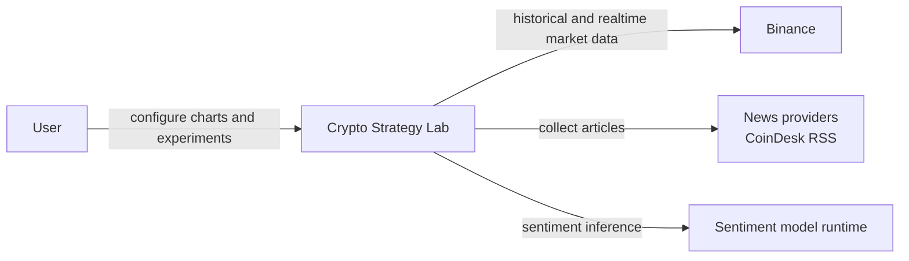
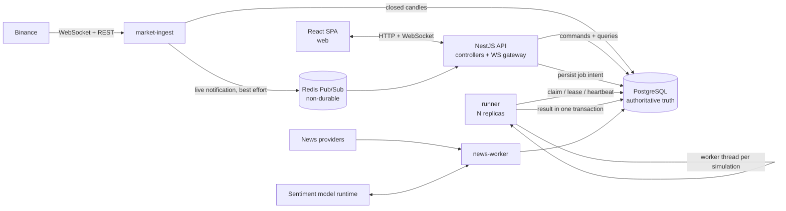
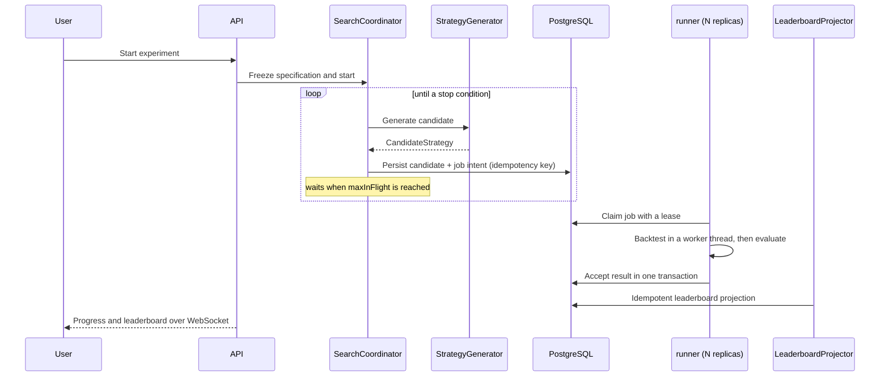

# Crypto Strategy Lab - Architecture Document

Submission deliverable 3 ("Architecture Document").
Date: 2026-09-04.

This document describes the architecture of the delivered system: what it is, why it is
shaped this way, how it behaves at runtime, and what it does and does not do. It is
self-contained. The only external references are the ten Architectural Decision Records
submitted alongside it as deliverable 4.

**Where the required views are:**

| Required view | Section |
|---|---|
| System Context | [§4](#4-system-context) |
| Container / Module decomposition | [§5](#5-container--process-view), [§6](#6-module-decomposition-and-component-responsibilities) |
| Component responsibilities | [§6](#6-module-decomposition-and-component-responsibilities) |
| Data Flow | [§8](#8-data-flow-and-ownership) |
| Realtime Flow | [§9](#9-realtime-flow) |
| Strategy Flow | [§10](#10-strategy-flow) |
| Search / Backtest Flow | [§11](#11-search--backtest-flow) |

The eight architecture questions from the assignment are answered together in
[§16](#16-the-eight-architecture-questions).

---

## 1. Introduction and scope

Crypto Strategy Lab is a platform for **systematically searching for trading
strategies**. It is not a trading bot. The architectural problem it solves is the one
the assignment states: build a system where MA and RSI exist today and SMC, Wyckoff, or
a sentiment strategy can be added tomorrow **without the old architecture breaking**.

The delivered architecture is a **modular monolith with separated process roles**: one
codebase and one release boundary, five logical modules with enforced dependency
directions, and four long-running process roles that can fail and scale independently.

Three decisions carry most of the weight:

1. **Extension happens at contracts, not at branches.** Strategies, search generators,
   market providers, combination policies, ranking policies, and sentiment models each
   sit behind a port with a registry. Adding one is an addition, never an edit to a
   type-switch.
2. **Heavy work does not share a process with interactive work.** Backtests run in a
   separate runner process, and inside it in a worker thread. The API never computes a
   backtest.
3. **PostgreSQL is the only authoritative truth.** Redis carries best-effort live
   notifications and is configured with persistence disabled. Nothing
   correctness-relevant depends on a Redis message arriving.

**Out of scope.** The system places no real orders. Exchange trading APIs, custody, and
portfolio execution are outside the project. There is no authentication: it is a
single-operator system.

### 1.1 What was built

| Element | Delivered |
|---|---|
| Logical modules | 5 (API, Market, Strategy, Experiment, News) |
| Enforced boundary rules | 6, executed as tests over the real source tree |
| Strategies | 6: MA, RSI, Bollinger Bands, Support/Resistance, MACD, News-Sentiment |
| Combination policies | 2: `majority-vote@1.0.0`, `weighted-score@1.0.0` |
| Strategy generators | 2: random search, grid search |
| Ranking policies | 1: `weighted-return-drawdown@1.0.0` |
| Metrics | 4: total return, win rate, maximum drawdown, number of trades |
| Market providers | 1 in production (Binance), plus a second one built to verify the port |
| News providers | 1 (CoinDesk RSS) |
| Architectural Decision Records | 10 |
| Automated tests | 787 across 136 files |
| Docker Compose services | 8 |

What is designed but **not** implemented is listed in one place, in
[§17](#17-implementation-status-limitations-and-future-work).

---

## 2. Architecture drivers

### 2.1 Functional requirements

| ID | Requirement | Status |
|---|---|---|
| REQ-01 | Ingest Binance historical and realtime data behind a provider boundary | Implemented |
| REQ-02 | Candlesticks and realtime updates for up to four independent timeframes | Implemented |
| REQ-03 | At least MA, RSI, Bollinger, Support/Resistance | Implemented (6 strategies) |
| REQ-04 | Add a strategy without rewriting the engine or unrelated components | Implemented |
| REQ-05 | Composite strategies with an explicit versioned combination policy | Implemented |
| REQ-06 | Backtest on identified historical data, producing trades and metrics | Implemented |
| REQ-07 | At least Random Search, generator replaceable without downstream change | Implemented |
| REQ-08 | Controlled search loop with stop conditions, user stop, visible progress | Implemented |
| REQ-09 | Top-K leaderboard with a defined ranking policy | Implemented |
| REQ-10 | Visualize signals, entry/exit, indicators, zones; show trade detail | Implemented |
| REQ-11 | Collect, normalize, store, analyze news sentiment behind replaceable boundaries | Implemented |
| REQ-12 | Trace a leaderboard entry to its exact experiment inputs and versions | Implemented |
| REQ-13 | Deliver architecture documentation and decision records | Implemented |

### 2.2 Architecture-significant requirements

These are the qualities that actually shaped the structure. Each one is the reason at
least one boundary exists.

| ID | Driver |
|---|---|
| ASR-MOD | Strategies, generators, providers, policies, and models must be replaceable at their boundary |
| ASR-SCAL | Candidate execution must scale by adding workers, without changing domain code |
| ASR-RT | Realtime updates without polling or full page reload |
| ASR-REL | Disconnect, duplicate work, and worker failure must have explicit, defined behaviour |
| ASR-MAINT | Unambiguous ownership across generation, simulation, evaluation, ranking, presentation |
| ASR-OBS | Loop status, failures, provider health, and the current leader must be observable |
| ASR-REP | Completed results must be reproducible from immutable provenance |
| ASR-INT | A partial failure must never commit a contradictory mix of trades, metrics, and status |

### 2.3 Anti-patterns the structure rules out

The assignment names five anti-patterns. Each is answered structurally, not by
convention:

| Anti-pattern | Structural answer |
|---|---|
| God service | Five modules with declared ownership and allowed dependency edges, checked by tests |
| Hard-coded strategy `if/else` chains | `Strategy` contract plus a descriptor registry; composition is a versioned policy |
| Frontend containing business logic | The web application may import only the shared API contracts package; this is a test-enforced rule |
| Strategy accessing the database directly | A strategy receives everything through an analysis context; it has no repository or provider handle |
| Crawler tightly coupled to the ML model | Collection and inference are separate stages with separate failure records; the collector never calls the model |

---

## 3. Key decisions and rejected alternatives

The design started from problems, not from technologies. Six problem branches drove
every structural decision:

```text
P-1  The system must evolve without ripple changes
     |-- P-1.1 Add a strategy without touching backtest, evaluation, ranking, UI
     |-- P-1.2 Replace the search method without touching candidate consumers
     `-- P-1.3 Add an exchange without leaking provider payloads into UI or domain

P-2  Experiment workload must be controllable and scalable
     |-- P-2.1 CPU-heavy backtests must not block interactive traffic
     |-- P-2.2 Candidate production can outrun consumption
     `-- P-2.3 A long run must be pausable, cancellable, and restart-safe

P-3  Realtime external data is unreliable
     |-- P-3.1 Connections drop and leave gaps in history
     `-- P-3.2 Four subscriptions change independently

P-4  Failures must stay local
     |-- P-4.1 News and ML failures must not stop charts or backtests
     `-- P-4.2 A worker crash must not corrupt committed results

P-5  Results must be reproducible
     `-- P-5.1 Strategy version alone is not enough to explain a number

P-6  State must be observable
     `-- P-6.1 Run status and the current leader must be visible without reload
```

### 3.1 The decisions

| ID | Decision | Chosen | Rejected, and why |
|---|---|---|---|
| D-01 | Overall style | Modular monolith with separated process roles ([ADR-001](../adr/ADR-001-modular-monolith-process-roles.md)) | **Single process**: one CPU-heavy backtest would block charts. **Domain microservices**: independent deployment ownership that a single team does not need, paid for in distributed-transaction and operational cost |
| D-02 | Strategy extensibility | Contract + descriptor registry + composition policy ([ADR-002](../adr/ADR-002-strategy-and-search-contracts.md)) | **Type-switch on strategy id**: exactly the anti-pattern the assignment names. **Runtime plugin loading**: security and versioning cost with no benefit at this scale |
| D-03 | Provider replaceability | Port + normalized contract ([ADR-003](../adr/ADR-003-provider-adapters.md)) | **Passing provider payloads through to the UI**: couples the frontend to Binance's schema forever |
| D-04 | Search replaceability | `StrategyGenerator` port returning `CandidateStrategy` ([ADR-002](../adr/ADR-002-strategy-and-search-contracts.md)) | **Generator logic inside the coordinator**: a new search method would then require editing the loop |
| D-05 | Experiment execution | Durable job queue + worker pool + durable coordinator state ([ADR-004](../adr/ADR-004-asynchronous-experiment-processing.md), [ADR-010](../adr/ADR-010-realization-sequencing-for-asynchronous-backtest-execution.md)) | **Synchronous HTTP backtests**: no pause/resume, no scale, request timeouts |
| D-06 | Result consistency | Single-transaction result acceptance, idempotency key derived from content ([ADR-005](../adr/ADR-005-transactional-results-leaderboard.md)) | **Multiple writes without a transaction**: a crash between them leaves metrics without trades |
| D-07 | Realtime delivery | WebSocket gateway + durable recovery source ([ADR-008](../adr/ADR-008-realtime-delivery-recovery.md)) | **HTTP polling**: the assignment explicitly asks for stream delivery. **Trusting live messages as truth**: a lost message would become a permanent gap |
| D-08 | Persistence | PostgreSQL, one schema per module ([ADR-001](../adr/ADR-001-modular-monolith-process-roles.md)) | **Shared tables across modules**: ownership becomes ambiguous and boundaries erode |
| D-09 | Leaderboard | Derived, rebuildable projection ([ADR-005](../adr/ADR-005-transactional-results-leaderboard.md)) | **Ranking computed on read**: cost grows with result count. **Projection as source of truth**: unrecoverable if corrupted |
| D-10 | News and sentiment | Isolated pipeline, model behind a port ([ADR-007](../adr/ADR-007-news-sentiment-isolation.md)) | **Crawler calling the model directly**: the anti-pattern the assignment names |
| D-11 | Frontend | React SPA, presentation only ([ADR-001](../adr/ADR-001-modular-monolith-process-roles.md)) | **Business logic in the frontend**: the anti-pattern the assignment names |
| D-12 | Technology | Node.js/TypeScript, NestJS at the edges, PostgreSQL, React ([ADR-009](../adr/ADR-009-technology-realization.md)) | **Kafka, Kubernetes, service mesh, Event Sourcing, general CQRS**: no measured driver at this scale |

### 3.2 Why there is no message broker

The assignment illustrates scalability with a Job Queue feeding three workers. That
picture demonstrates a *property*: execution capacity should grow by adding workers,
without changing domain code. It is an explanation of why queues matter, not an
instruction to install a specific broker.

The architecture adopts the property and reaches it with the simplest mechanism that
satisfies it today: a PostgreSQL-backed durable queue with atomic claim, lease, and
heartbeat. Several runner processes share one queue safely because the claim is a single
atomic database operation. Job state lives in the authoritative store, so the
correctness model does not depend on the transport.

That choice has a cost, and it is stated in [§17.1](#171-designed-but-not-implemented):
queue-level retry policy, stall detection, and queue-depth metrics are things a broker
would provide out of the box, and this system does not have them. The migration path is
recorded in
[ADR-010](../adr/ADR-010-realization-sequencing-for-asynchronous-backtest-execution.md).

---

## 4. System context



- The **user** views up to four market charts, selects strategies, runs experiments,
  watches progress, explores leaderboard results and individual trades, and views news
  sentiment.
- **Binance** is the delivered exchange, reached through a provider port. Other
  exchanges are adapters behind the same port.
- **News providers** supply raw content under their own formats and rate limits.
- The **sentiment model runtime** is replaceable. Its identity and version are recorded
  with every result, so old results stay interpretable after the model changes.

---

## 5. Container / process view



### 5.1 Process roles

| Role | Why it is a separate process | Replicas |
|---|---|---|
| `web` | Browser delivery and presentation lifecycle | 1 |
| `api` | Interactive request and connection profile; must stay responsive | 1 |
| `market-ingest` | Owns a long-lived provider connection and gap recovery | 1 |
| `runner` | CPU-heavy work and horizontal scale | **N, configurable** |
| `news-worker` | External crawling and model failures with distinct dependencies | 1 |
| `migrate` | One-shot schema migration before the others start | one-shot |
| `postgres` | Authoritative durable state | 1 |
| `redis` | Best-effort live fan-out only, persistence disabled | 1 |

All Node.js roles share one image and one build; they differ only by entry command.
**These are process roles, not microservices.** They have no independent release cycle,
no separate ownership, and no private data contract.

### 5.2 The Redis configuration is part of the argument

Redis runs with `--save "" --appendonly no`, that is, persistence explicitly disabled.
This is not an oversight. It is how the architecture *enforces* that no
correctness-relevant state can accumulate in Redis: if the process restarts, everything
in it is gone, and the system must still be correct. Losing a live notification only
means a chart waits for its next durable snapshot.

---

## 6. Module decomposition and component responsibilities

Five modules. Each owns its data, exposes ports, and may only depend downward.

```text
API / Presentation  ->  market, strategy, experiment, news   (application/query ports)
Experiment          ->  strategy, market, news               (public contracts only)

Strategy domain     ->  no infrastructure module
Market domain       ->  no strategy / experiment / news module
News domain         ->  no strategy / experiment module
No module           ->  another module's repository, tables, or private provider
```

These are not conventions. They are enforced as tests; see
[§7.1](#71-how-the-boundaries-are-enforced).

### 6.1 API / Presentation

- **HTTP endpoints** validate transport DTOs and invoke module use cases.
- **WebSocket gateway** owns client sessions, subscription IDs, filtering, and the
  reconnect protocol.
- **Query composition** assembles responses from module query ports.
- **Transport mapping** converts application contracts to JSON.

Owns transport. **Does not own** any strategy, backtest, metric, or ranking calculation.

### 6.2 Market Data

- **`MarketDataProvider` port** - historical fetch, live subscription, provider health.
- **Binance adapter** - maps provider messages, errors, and rate behaviour to normalized
  contracts.
- **Candle normalizer** - validates symbol, timeframe, timestamps, and OHLCV invariants.
- **Ingestion and reconciliation** - deduplicates, persists closed candles, detects
  missing intervals, refetches, resumes.
- **Market data query** - reads an identified dataset range for charts and experiments.

Owns provider connections, normalized candle meaning, gap recovery, candle persistence,
and dataset identity.

### 6.3 Strategy

- **`Strategy` contract and implementations** - pure analysis of a supplied context into
  a normalized signal plus optional annotations.
- **`StrategyDescriptor` and registry** - stable id, semantic version, parameter schema,
  category, **required inputs**, implementation binding.
- **`CompositeStrategy`** - immutable ordered component references and parameters.
- **`CombinationPolicy`** - versioned signal aggregation, independent of components.
- **`StrategyGenerator` port** - random and grid implementations; returns
  `CandidateStrategy` only.

Owns registration, version identity, parameter validation, signal semantics,
composition, and candidate specification. **Does not own** experiment lifecycle, market
connections, persistence adapters, simulation, metrics, or ranking.

A strategy cannot reach a database or a provider. It receives everything it needs
through its analysis context.

### 6.4 Experiment

- **Experiment specification service** - creates, validates, and **freezes** a
  specification at start.
- **Search coordinator** - owns run state and stop policy, requests candidates, creates
  idempotent jobs, applies backpressure.
- **Backtest run store** - persists job intent; claim, lease, heartbeat, stale-claim
  sweep.
- **Backtester** - deterministic trade simulation from a frozen candidate, dataset, and
  execution configuration.
- **Evaluator** - versioned metric calculation from simulation output; it never
  generates signals.
- **Ranking policy** - versioned score and tie-break calculation from metrics.
- **Result acceptor** - commits identity, metrics, completion state, provenance, and
  trades in one transaction, keyed by the idempotency key.
- **Leaderboard projector** - derives Top-K read models idempotently.
- **Experiment and provenance queries** - run progress, failures, results, provenance,
  trades, leaderboard.

Owns experiment lifecycle, search runs, jobs, simulation, evaluation, ranking, results,
and projections.

### 6.5 News Intelligence

- **`NewsProvider` port and adapters** - source-specific collection behind one contract.
- **Normalizer and deduplicator** - canonical `NewsItem` identity and source provenance.
- **`SentimentAnalyzer` port and model adapter** - maps an item to a versioned
  `SentimentResult` without exposing its language or model to Strategy or Experiment.
- **Repositories** - raw and normalized items, analysis attempts, results, model
  versions, failure states.
- **Sentiment feature query** - time-windowed normalized sentiment input.

Owns collection, normalization, news persistence, inference lifecycle, sentiment results
and versions, and degraded state. The collector never calls the model.

---

## 7. Contracts

These are the architecture-level data contracts. They are what makes the boundaries
real: a module is replaceable exactly to the extent that its contract hides its
implementation.

| Contract | Key semantic fields | Owner and rule |
|---|---|---|
| `Candle` | provider, symbol, timeframe, open/close time, OHLCV, closed flag | Market Data; identity is provider + symbol + timeframe + open time |
| `DatasetRef` | dataset id/version, provider, symbol, timeframe, range, manifest hash | Market Data; immutable once a started experiment references it |
| `StrategyDescriptor` | id, semantic version, parameter schema, **required inputs**, implementation reference | Strategy; versions are append-only |
| `Signal` | action enum, effective time, optional confidence, annotation references | Strategy; carries no provider payload |
| `CompositeStrategy` | ordered component refs and params, combination policy id/version | Strategy; immutable candidate content |
| `CandidateStrategy` | candidate id, complete composite spec, generator provenance, content hash | Strategy; Experiment executes it without knowing how it was generated |
| `ExperimentSpec` | dataset, candidate, execution config, engine/build, metric and ranking policy versions, stop policy, optional sentiment input, seeds | Experiment; mutable only in draft, **immutable after start** |
| `BacktestJob` | job id, experiment id, candidate hash, attempt, **idempotency key** | Experiment; immutable command, at-least-once safe |
| `BacktestResult` | result id, refs, trades, metrics, provenance, timestamps, status | Experiment; one logical result per idempotency key |
| `LeaderboardEntry` | rank, score, result and experiment refs, policy version | Experiment; derived and rebuildable, never source of truth |
| `NewsItem` | id/content hash, title, source, url, published time, related assets | News; normalized and deduplicated |
| `SentimentResult` | news id, label/score, model name/version, input version, status | News; append-only |

### 7.1 How the boundaries are enforced

An architecture document does not stop anyone from writing a forbidden import. Six
boundary rules run as ordinary tests over the real source tree, so a violation fails
`pnpm run test`:

| Rule | What it blocks |
|---|---|
| `BOUND-1-INDEX-ONLY` | Importing a module through anything other than its public `index.ts` |
| `BOUND-2-ALLOWED-EDGE` | A cross-module edge that is not in the declared allowed list |
| `BOUND-3-DOMAIN-PURITY` | Domain code importing NestJS, HTTP clients, or other infrastructure |
| `BOUND-4-PLATFORM-NO-MODULES` | Shared platform code depending on any business module |
| `BOUND-5-NO-INTERNAL-REACH` | Anything outside a module importing its internals |
| `BOUND-6-WEB-CONTRACTS-ONLY` | The frontend importing backend code instead of only `api-contracts` |

The allowed edges are declared as data, not as prose:

```ts
export const ALLOWED_MODULE_EDGES: Readonly<Record<string, readonly string[]>> = {
  api: ["market", "strategy", "experiment", "news"],
  experiment: ["strategy", "market", "news"]
};
```

Each rule has a synthetic violating fixture proving the rule actually fires rather than
passing vacuously.

**Honest limit:** `BOUND-6` proves the web application imports no backend code. It
cannot prove that nobody reimplemented a calculation by hand in TypeScript on the
frontend. That remains a review responsibility.

### 7.2 The execution model contract

Reproducibility depends on the backtest execution model being explicit rather than
defaulted, so it is stated in full:

```ts
interface ExecutionModelConfiguration {
  initialCapital: number;
  feeRate: number;
  slippageRate: number;
  signalTiming: "close-of-bar";
  fillRule: "next-open";
  maxConcurrentPositions: 1;
  leverage: 1;
  positionSizing: "available-equity";
  allowedDirections: readonly ("long" | "short")[];
  stopLoss: ExitRule;
  takeProfit: ExitRule;
  sameBarExitPriority: "stop-loss-first";
  finalPositionPolicy: "liquidate-at-final-close";
  decimalPlaces: 8;
}
```

Two fields are the difference between a believable backtest and a misleading one:

- **`signalTiming: "close-of-bar"` with `fillRule: "next-open"`** means a signal derived
  from a bar can only be filled on the *next* bar's open. A strategy therefore cannot
  trade on information it could not have had. This is the structural defence against
  look-ahead bias.
- **`sameBarExitPriority: "stop-loss-first"`** resolves the genuinely ambiguous case
  where one bar's range touches both the stop and the target. Without a declared rule,
  the same data could produce two different results.

Every field here is frozen into the experiment specification, so changing any of them
produces a new specification identity rather than silently reinterpreting old results.

---

## 8. Data flow and ownership

| Data | Owner | How others reach it | Rule |
|---|---|---|---|
| Candles, provider health, dataset manifests | Market Data | Query port | No writes from outside Market Data |
| Strategy descriptors, parameter schemas, composite definitions | Strategy | Public registry | Versions used by completed runs are never overwritten |
| Experiments, run state, candidates, jobs, attempts | Experiment | API query port | Experiment is the sole state-transition owner |
| Trades, metrics, results | Experiment | Query port | Acceptance is one transaction: identity, metrics, state, provenance, trades |
| Leaderboard projection | Experiment | Read port | Rebuildable from authoritative results |
| News items, source health | News | Query port | Source and provenance metadata preserved |
| Sentiment attempts, results, model metadata | News | Feature query | Old results keep their old model identity |

One PostgreSQL instance holds four module-owned schemas: `market`, `strategy`,
`experiment`, `news`. Foreign keys inside a module are allowed. **Cross-module writes
are forbidden**, and cross-module reads go through public query interfaces.

---

## 9. Realtime flow

```text
1. Client opens a WebSocket and sends Subscribe(subscriptionId, symbol, timeframe).
2. API returns the durable chart snapshot from the market query port.
3. market-ingest receives Binance updates and normalizes them.
4. It validates and deduplicates; a closed candle is committed to PostgreSQL.
5. It publishes a live notification keyed by symbol and timeframe (best effort).
6. API forwards only to matching subscription IDs. Other charts are untouched.
7. On disconnect: mark health degraded, reconnect with backoff, compute the missing
   closed intervals, refetch them over REST, upsert by candle identity, resume live.
8. On client reconnect: request a fresh durable snapshot before resuming live updates.
```

Four chart slots are declared in one place in the frontend, each holding its own
timeframe state. The backend holds however many subscriptions the page opens and keeps
no count of its own, so "four" is a layout decision, not an architectural limit.

**Ephemeral notifications may be lost, and correctness does not depend on replaying
them.** Durable candle state plus provider reconciliation repairs the view. This is why
Redis can run without persistence.

### 9.1 Recovery is the ordinary write path

The recovery mechanism deserves emphasis because it is where most systems introduce a
bug. Missing intervals are refetched and written through **the same append-only writer
that live candles use**, bounded by `MAX_RECOVERY_PASSES`. There is no separate repair
path that could apply different validation, so recovery cannot produce a gap or a
duplicate that the normal path would have rejected.

Reconnect uses a documented 1s to 30s backoff schedule, chosen against Binance's
published budget of 300 attempts per 5 minutes.

---

## 10. Strategy flow

```text
1. Resolve immutable strategy descriptors and versions; validate parameters.
2. Build the analysis context from the identified dataset plus any requested
   optional feature series.
3. Invoke each strategy. No database, provider, or UI access is available to it.
4. Collect the normalized signal plus annotations.
5. Apply the versioned combination policy.
6. Return the composite decision to the backtester with evidence references.
```

### 10.1 Composition and conflict resolution

Two policies are delivered:

- **`majority-vote@1.0.0`** - plurality over buy and sell. Hold is the default rather
  than a competing option, so BUY 2 / HOLD 1 resolves to buy. An exact buy/sell tie has
  no winner and resolves to hold.
- **`weighted-score@1.0.0`** - weighted aggregation of component signals.

The policy is a versioned contract independent of its components, so a new policy is a
new implementation rather than an edit to composite logic.

### 10.2 Sentiment is an input, not a special case

`NewsSentimentStrategy` is an ordinary `Strategy`. It declares
`requiredInputs: ["sentiment-series"]` and receives that series through the same
analysis context that carries price bars. It never calls the News module, and the
Strategy Engine has no branch for it.

The architectural payoff: a sentiment strategy composes with technical strategies
through the ordinary combination policies, and the missing-data policy is frozen into
the experiment specification instead of being decided at runtime. Replacing the
sentiment model changes nothing in Strategy or Experiment.

**Limit, stated plainly:** this path is exercised through the API and in tests, not
through the Backtest page form. That page can only supply price bars, so it filters the
catalog to strategies whose declared inputs it can satisfy. The capability is real and
works over HTTP; it is not clickable in the UI.

---

## 11. Search / backtest flow



### 11.1 The loop, and how it stays controllable

The coordinator runs the full generate to execute to measure to rank to improve loop
with:

- **Four stop conditions**: `max-candidates`, `max-duration`, `no-improvement`, and
  natural `exhausted`.
- **Durable control states** modelled as requested-then-settled -
  `running / pausing / paused / cancelling / cancelled / stopped` - rather than one
  boolean flag. A restart in the middle of a transition still converges correctly.
- **Backpressure through `maxInFlight`**, so the coordinator waits instead of growing
  the backlog without limit.
- **Resumption after restart**, including an iterator fast-forward so a resumed run does
  not re-propose candidates it already generated.

### 11.2 How work reaches a runner

Job intent is written to PostgreSQL before any execution. Runners **claim** work with a
**lease**, refresh it with a **heartbeat**, and a **stale-claim sweep** reclaims work
whose lease expired. Several runner processes can share one queue safely because the
claim is an atomic database operation.

Each job carries a **content-derived idempotency key**, so redelivery or a retry after a
crash finds the existing committed result instead of producing a second one.

### 11.3 Why the leaderboard is a projection

Ranking is computed once when a result is accepted and stored as a Top-K projection, not
recomputed on every read. The projection is derived and **rebuildable** from
authoritative results, and it links back to the result and the frozen specification. It
is never the source of truth, so corrupting it costs a rebuild rather than data.

The delivered ranking policy is `weighted-return-drawdown@1.0.0`:

```text
score = weightTotalReturn * totalReturn + weightMaximumDrawdown * maximumDrawdown
```

with a `minTrades` gate that makes a candidate with too few closed trades ineligible
rather than merely low-scoring, and win rate used only as a tie-break. The weights and
the gate live in the configuration carried on the frozen specification, so changing them
creates a new recorded version instead of silently reinterpreting old results.

---

## 12. News and sentiment flow

```text
Scheduled collection -> NewsProvider -> normalize and deduplicate NewsItem
  -> commit item -> claim a sentiment analysis attempt -> SentimentAnalyzer
  -> commit versioned SentimentResult -> sentiment feature query (on request)
```

Two independent failure modes, handled separately:

- **Collector failure** records source health without ever invoking the model.
- **Model failure** records a failed analysis attempt with a reason and leaves the
  normalized news item intact for retry.

Neither can stop market charts, technical backtests, or discovery, because `news-worker`
is a separate process role and the API's news endpoints degrade to an explicit
unavailable state rather than failing the page.

Delivered realization: CoinDesk RSS behind `NewsProvider`; an OpenAI Responses model
behind `SentimentAnalyzer`. Neither choice reaches Strategy or Experiment, which see
only a normalized sentiment series.

---

## 13. Reproducibility and provenance

Every started experiment receives an **immutable specification identified by a
canonical-JSON content hash**, so two logically identical specifications produce the
same identity regardless of key order
([ADR-006](../adr/ADR-006-immutable-experiment-provenance.md)).

A leaderboard row is reproducible only if it resolves all applicable fields:

1. Strategy ids and semantic versions
2. Every strategy parameter and component order
3. Combination policy id, version, thresholds, weights
4. Generator id, version, search configuration and space, random seed
5. Dataset id, version, manifest, provider, symbol, range, timeframe, candle revision
6. Initial capital and position/side rules
7. Fee, slippage, fill, stop-loss, take-profit, sizing, rounding configuration
8. Backtest engine version, Node.js runtime version, dependency-lock hash, application
   and worker build identifiers
9. Metric-set and ranking-policy versions
10. News item set identity when sentiment participates
11. Sentiment model name, version, input and preprocessing version
12. All random seeds and nondeterminism declarations
13. Job attempts, timestamps, and result artifact hashes

**"Same strategy version" is therefore insufficient**, which is the point. Item 8 is the
one most systems omit, and it is the one that explains why the same code can produce a
different number on a different machine.

Observed in the running system: 302 backtest runs carry 302 distinct content-derived
idempotency keys, so no two logically different runs collapsed into one identity and no
run was committed twice.

---

## 14. Failure and recovery behaviour

| Failure | Delivered behaviour |
|---|---|
| Binance WebSocket disconnects | Health degraded, backoff reconnect, missing intervals computed and refetched through the ordinary write path, live flow resumes |
| Runner process dies mid-backtest | Its lease expires, the stale-claim sweep reclaims the work, and the attempt closes with an explicit reason |
| Runner dies after committing a result | The idempotency key finds the committed result; no second result is created |
| API restarts during a search | Run state is durable in PostgreSQL; the coordinator resumes from it |
| Redis unavailable | Live notifications stop; charts fall back to durable snapshots. No experiment, candle, or result is affected |
| News collection fails | Source health is recorded; charts, backtests, and discovery continue |
| Sentiment model unavailable | The attempt is recorded as failed with a reason; the news item survives; only sentiment-dependent work degrades |
| PostgreSQL unavailable | The system stops accepting work. This is intended: it is the authoritative store |

The lease-expiry path is not only a designed behaviour. It occurred during ordinary
operation and is visible in the stored attempt history: a runner holding a claim
stopped, the claim expired, the sweep reclaimed the work, and the attempt was closed
with reason `BACKTEST_LEASE_EXPIRED` rather than being lost or silently duplicated.

---

## 15. Deployment and scaling

### 15.1 Delivered topology

The whole system comes up from a clean checkout with one command:

```bash
docker compose up --build
```

Eight services: `postgres`, `redis`, `migrate` (one-shot), `api`, `runner`,
`market-ingest`, `news-worker`, `web`.

The `runner` service deliberately has **no `container_name`**, which is exactly what
makes `docker compose up --scale runner=N` possible.

### 15.2 Observed scaling behaviour

Backtesting is the only CPU-heavy work in the system, so it is the only thing worth
measuring. The workload was 24 candidates from random search with `maxInFlight: 8`, on
Binance BTCUSDT 1h data over a 30-day window, running the whole Compose topology on one
laptop (Intel Core i7-1355U, 12 logical CPUs, 15.7 GB RAM).

Scaling the runner required **one command and no source change**:

| Runner replicas | Median run time |
|---|---|
| 1 | 14548 ms |
| 3 | 9802 ms |

**The decisive observation is the work distribution, not the wall clock.** During the
three-replica window, three independent runner processes claimed work from the same
queue (61 / 12 / 11 attempts), and two of them did not exist when the workload started.
Correctness held: no run produced more than one successful attempt.

**What this does not establish.** Three replicas gave roughly 1.5x, not 3x, and the two
configurations' timing ranges overlap, so this shows a direction rather than a factor.
The largest workload measured is 24 candidates, so no capacity, throughput, or latency
target is claimed, and none was accepted as a requirement: a target measured on one
contended laptop would mislead rather than inform.

### 15.3 Scale-out path

1. Add runner replicas while watching claim contention and PostgreSQL load.
2. Move to a message broker when queue-level retry, stall detection, and depth metrics
   are needed (see [§17.1](#171-designed-but-not-implemented)).
3. Add API replicas only after WebSocket fan-out and connection load are measured.
4. Partition or archive candle and result data only after a measured bottleneck.
5. Consider an external model service, a database split, or an orchestrator only through
   a new decision record tied to evidence.

Kubernetes, service mesh, microservices, Kafka, Event Sourcing, and general CQRS are not
part of this design.

---

## 16. The eight architecture questions

### Q1. How is a new strategy added? What does adding `MACDStrategy` change?

Implement the `Strategy` contract, declare a descriptor with an id, semantic version,
parameter schema, and required inputs, then register it.

**What does not change:** the backtester, evaluator, ranking policy, leaderboard,
provider adapters, persistence, and the frontend core. The chart renders indicators from
generic annotation primitives, so a new strategy's visuals need no chart code.

MACD was genuinely added this way, after the other strategies existed, with no change to
any downstream component.

### Q2. How is a new search algorithm added? Does it affect the backtesting engine?

Implement `StrategyGenerator` and register it. It returns `CandidateStrategy` and
nothing else.

**No, it does not affect the backtesting engine.** Downstream components receive a
candidate and cannot inspect how it was produced. Grid search was added alongside random
search with no downstream change.

### Q3. How is a new market data provider added? Does the frontend change?

Implement `MarketDataProvider` and map the provider's payload to the normalized candle
contract inside the adapter.

**No, the frontend does not change.** A second provider was built and passed the common
provider contract suite; its normalized candles were persisted, resolved as an immutable
dataset, and rendered by **the unchanged production chart**.

The frontend never sees a provider payload, and `BOUND-6` makes that structural rather
than a matter of discipline.

### Q4. If backtests grow from 100 to 100,000, how does the architecture change?

This question has an architectural answer and an empirical answer, and they are not the
same answer.

**Architecturally, it does not change.** Execution sits behind the `BacktestComputation`
port and runs in a process role that is not the API. Nothing in the Strategy or
Experiment domain knows how many workers exist, so adding capacity is a deployment
decision. Backpressure through `maxInFlight` bounds in-flight work regardless of scale.

**Empirically, this was only observed at small scale.** Three runner replicas were added
with one command, shared one queue correctly, and completed the same workload in a
median 9802 ms against 14548 ms with one replica. That is roughly 1.5x, not 3x.

**What would change at genuinely large scale:** moving from the PostgreSQL-backed queue
to a message broker, for queue-level retry, stall detection, and depth metrics. That is
designed and sequenced but not implemented; see
[§17.1](#171-designed-but-not-implemented).

### Q5. If the News Service fails, does the chart still work?

**Yes.** News collection runs in a separate `news-worker` process. Charts are served by
the API from PostgreSQL candles written by `market-ingest`, and neither depends on the
news pipeline. The news endpoints degrade to an explicit unavailable state rather than
failing the page. This was checked by stopping news collection while charts and technical
backtests continued.

### Q6. If the sentiment model changes, is the Strategy Engine affected?

**No.** The model sits behind the `SentimentAnalyzer` port. Strategy and Experiment see
only a normalized sentiment series delivered through the analysis context; they never
learn the model's identity, language, or hosting.

Replacing the model means binding a new adapter. Results already stored keep their
original model name and version, so old results stay interpretable rather than being
retroactively relabelled.

### Q7. If the Binance WebSocket disconnects, how does the system recover?

Market Data marks provider health degraded and reconnects on a documented 1s to 30s
backoff schedule, chosen against Binance's budget of 300 attempts per 5 minutes. On
reconnect it computes exactly which closed intervals are missing, refetches them over
REST, and writes them **through the same append-only writer that live candles use**,
bounded by `MAX_RECOVERY_PASSES`.

Because recovery reuses the ordinary write path rather than a special repair path, it
can produce neither a gap nor a duplicate. Live notifications lost during the outage do
not matter: the durable candle store plus reconciliation is the recovery source.

### Q8. How do you check which strategy version produced a leaderboard result?

Open the leaderboard entry. It links to its authoritative result, which links to the
**frozen experiment specification** identified by a canonical-JSON content hash.

That specification resolves the complete chain: strategy ids and versions, every
parameter and component order, combination policy version, generator and seed, dataset
manifest, execution configuration, metric-set version, ranking-policy version, backtest
engine version, Node.js runtime version, dependency-lock hash, and application and
worker build identifiers.

A rerun compares trade and metric artifact hashes. Observed in the running system: 302
runs with 302 distinct idempotency keys.

---

## 17. Implementation status, limitations, and future work

A report that lists only strengths is not evidence of engineering judgement. This
section collects everything the system does not do, in one place.

### 17.1 Designed but not implemented

The design specifies a final asynchronous realization built on a message broker. It is
specified and sequenced in
[ADR-010](../adr/ADR-010-realization-sequencing-for-asynchronous-backtest-execution.md),
and it is **not built**. It was left unbuilt rather than half-built.

| Element | Current implementation | Planned |
|---|---|---|
| Durable job delivery | PostgreSQL table with claim, lease, heartbeat, stale-claim sweep | BullMQ with a persistence-configured Redis |
| Worker pool | Separate `runner` process role, worker thread per simulation | Unchanged |
| At-least-once safety | Content-derived idempotency key on every job | Unchanged, plus an idempotent broker consumer |
| Cross-process publication | Direct writes inside the accepting transaction | Transactional outbox with a dispatcher |

What is consequently **not available today**: broker-level retry policy, duplicate
delivery handling at the transport layer, stall detection, and queue-depth or
job-latency metrics.

The invariant that survives both realizations: **PostgreSQL is authoritative and Redis
is best-effort.** Because the current executor keeps job state in the authoritative
store, moving to a broker later changes the transport, not the correctness model.

### 17.2 Known limitations of what is built

1. **Single operator.** No accounts, authentication, or authorization. This was a scope
   decision. Public multi-tenant operation would require an architecture review.
2. **Frontend combination-policy options are not metadata-driven.** The backend exposes
   policies as versioned contracts, but the frontend lists them statically. Adding a
   third policy would require a frontend edit, which is a real, if small, coupling.
3. **Sentiment as a strategy is not reachable from the Backtest page.** The page can
   only supply price bars, so it filters the catalog accordingly. The capability works
   over HTTP and in tests.
4. **Backtest duration is not surfaced in the UI.** It is recorded durably per attempt
   and queryable at any time, but no dashboard shows it.
5. **One production market provider.** Binance only. Replaceability is demonstrated; a
   second live exchange is not built.
6. **Optional metrics are not implemented.** Profit Factor and Sharpe are absent. The
   evaluator holds an extensible list of metric definitions, so adding them is an
   addition rather than a change, but supporting a thing is a different claim from
   having built it.
7. **Optional search methods are not implemented.** No genetic, Bayesian, or LLM search.
   The generator port is demonstrably replaceable; those algorithms are not built.
8. **No data retention policy.** Nothing is deleted. Not required at demo scale.
9. **Scale is unproven beyond small workloads.** See
   [§15.2](#152-observed-scaling-behaviour).

### 17.3 Risks and when to revisit a decision

| Risk | How the delivered system limits it |
|---|---|
| Capacity unknown at large scale | Duration measured and recorded per attempt; no capacity claimed |
| PostgreSQL contention as results grow | Module-owned schemas, indexes driven by query evidence, partitioning kept as a recorded trigger |
| Provider data quality (gaps, revisions) | Dataset manifests, validation, gap status, immutable experiment references |
| Backtest correctness (look-ahead, fills) | Close-of-bar signal timing with next-open fill, declared same-bar priority, deterministic fixtures |
| Model reproducibility with a hosted model | Provider, model, version, and input version recorded with every result |
| News licensing and parser risk | Provider behind a port, bounded fetch, no crawler-to-model coupling |

Reopen the affected decision when evidence shows any of: independent teams requiring
independent deployment; a module needing scaling the process roles cannot provide;
PostgreSQL contention unresolvable within module schemas; durable event replay becoming
a demonstrated requirement; or public multi-tenant deployment. Reopening produces a new
decision record; existing records stay as history and are never rewritten.

---

## 18. Conclusion

The delivered system is a modular monolith with separated process roles: five logical
modules whose boundaries are enforced by tests rather than by convention, extension
points at every axis the assignment asks about, and a reproducibility model that makes
each leaderboard number explainable down to the dependency-lock hash.

Measured against the question the assignment actually asks - *can components change,
extend, and operate independently while the whole system stays correct, observable, and
maintainable* - the concrete answer is: six strategies behind one contract, with MACD
added after the fact and nothing downstream changed; two search generators with
consumers untouched; a second market provider rendered by the unchanged production
chart; three runner processes sharing one queue with no duplicate result; and a
disconnect-recovery path that reuses the ordinary write path, so it cannot invent a gap.

The architecture is deliberately smaller than what the assignment's examples illustrate.
It has no message broker, no microservices, no event sourcing, and no orchestrator,
because no measured driver justified them at this scale. Where a mechanism is designed
but not built, it is named and marked rather than described as if it existed.

That combination - what works, what was measured, and what is explicitly not claimed -
is the argument this document makes.
