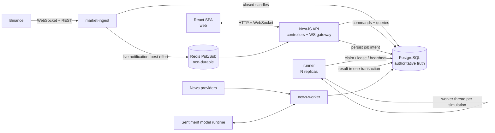
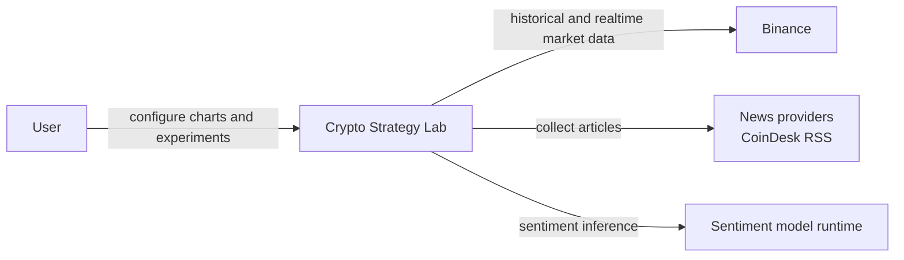
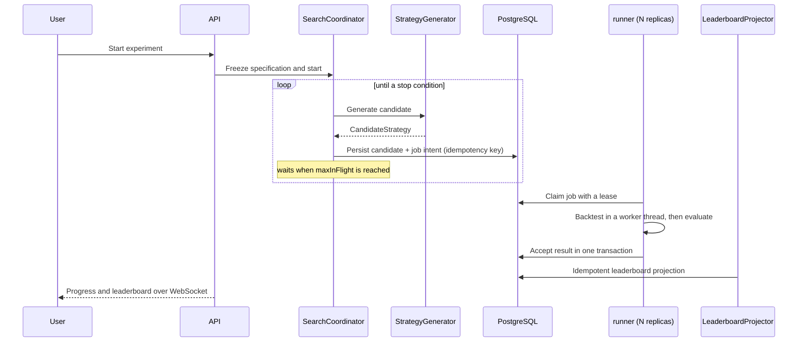

# Crypto Strategy Lab - Architecture Report

Document type: **Architecture Document** (the deliverable required by the official
source, section 45 "Deliverables", item 3).

Product version described: **V5**
Architecture baseline: **FROZEN v1.2**
Report date: 2026-09-04

## How to read this document

This report describes the architecture of the system **as delivered**. It answers two
different questions and keeps them apart on purpose:

1. *What is the architecture, and why is it shaped this way?*
2. *How much of that architecture is actually implemented in what was submitted?*

The second question is the one a design document usually leaves out. Every section
below marks realization status explicitly. Where something is designed but not built,
it is labelled **V6 - not implemented** and is never described in the present tense.

This document is self-contained: a reader can finish it without opening another file.
The links are there for someone who wants the underlying record, not because the
argument depends on them.

### Relationship to the other architecture documents

| Document | What it is | Why it is separate |
|---|---|---|
| **This report** | The architecture of the delivered system, plus realization status | The submission-facing document |
| [`architecture-baseline.md`](architecture-baseline.md) | The normative frozen constraint (v1.2) | Implementation must obey it; it does not describe what was built |
| [`architecture-proposal.md`](architecture-proposal.md) | The reasoning record that led to the baseline, accepted 2026-08-21 | A historical artifact. It is deliberately **not** updated to match the implementation, because rewriting it would destroy the record of why the baseline was chosen |
| [`docs/adr/`](../adr/) | Ten accepted decisions with context, options, consequences | Decision history, append-only |
| [`docs/evidence/README.md`](../evidence/README.md) | Evidence portal: claim to proof mapping | Verification, not design |

If this report and the baseline ever disagree, the baseline wins and this report is
wrong. If this report and the proposal disagree about *what exists today*, this report
wins, because the proposal predates the implementation.

---

## 1. Executive summary

Crypto Strategy Lab is a platform for **systematically searching for trading
strategies**, not a trading bot. The architectural problem it solves is stated in the
official source, section 39: build a system where MA and RSI exist today and SMC,
Wyckoff, or sentiment can be added tomorrow **without the old architecture breaking**.

The delivered architecture is a **modular monolith with selectively separated process
roles**: one codebase and one release boundary, five logical modules with enforced
dependency directions, and four long-running process roles that can fail and scale
independently.

The three decisions that carry most of the weight:

1. **Extension happens at contracts, not at branches.** Strategies, search generators,
   market providers, combination policies, ranking policies, and sentiment models each
   sit behind a port with a registry. Adding one is an addition, never an edit to a
   type-switch.
2. **Heavy work does not share a process with interactive work.** Backtests run in a
   separate runner process, and inside it in a worker thread. The API never computes a
   backtest.
3. **PostgreSQL is the only authoritative truth.** Redis carries best-effort live
   notifications and is explicitly configured non-durably. Nothing correctness-relevant
   depends on a Redis message arriving.

What is **not** delivered is the final asynchronous realization (V6): BullMQ, the
transactional outbox, and the idempotent broker consumer. That gap is deliberate,
recorded in [ADR-010](../adr/ADR-010-realization-sequencing-for-asynchronous-backtest-execution.md),
and is marked everywhere it appears in this document.

---

## 2. What was delivered

### 2.1 Realization status at a glance

| Architecture capability | Status | Where it is described |
|---|---|---|
| Five logical modules with enforced boundaries | **Realized** | [§7](#7-logical-module-decomposition) |
| Strategy contract + registry (6 strategies) | **Realized** | [§7.3](#73-arc-strategy---strategy) |
| Composite strategy + versioned combination policy | **Realized** | [§12](#12-strategy-flow) |
| `StrategyGenerator` port (random + grid) | **Realized** | [§13](#13-search--backtest-flow) |
| `MarketDataProvider` port (Binance) | **Realized** | [§7.2](#72-arc-market---market-data) |
| Realtime WebSocket delivery, 4 independent charts | **Realized** | [§11](#11-realtime-flow) |
| Gap recovery after provider disconnect | **Realized** | [§11](#11-realtime-flow) |
| Separate market-ingest process role | **Realized** | [§6](#6-container--process-view) |
| Separate backtest runner process + worker threads | **Realized** | [§6](#6-container--process-view) |
| PostgreSQL-backed durable job queue (claim/lease/heartbeat) | **Realized** | [§13](#13-search--backtest-flow) |
| Horizontal runner scaling by configuration | **Realized, measured** | [§14](#14-deployment-model) |
| Controlled search loop, pause/resume/cancel, restart-safe | **Realized** | [§13](#13-search--backtest-flow) |
| Immutable experiment specification + canonical hashing | **Realized** | [§16](#16-reproducibility-model) |
| Full provenance chain for a leaderboard row | **Realized** | [§16](#16-reproducibility-model) |
| Leaderboard projection, rebuildable | **Realized** | [§13](#13-search--backtest-flow) |
| News collection behind `NewsProvider` port | **Realized** | [§15](#15-news-and-sentiment-flow) |
| Sentiment behind `SentimentAnalyzer` port | **Realized** | [§15](#15-news-and-sentiment-flow) |
| Sentiment as a declared Strategy input | **Realized** | [§12](#12-strategy-flow) |
| News/sentiment failure isolation | **Realized, proven** | [§18](#18-failure-and-recovery-behaviour) |
| Redis Pub/Sub best-effort live notification | **Realized** | [§11](#11-realtime-flow) |
| **BullMQ durable job delivery** | **V6 - not implemented** | [§20](#20-realization-deviations-from-the-baseline) |
| **Transactional outbox + dispatcher** | **V6 - not implemented** | [§20](#20-realization-deviations-from-the-baseline) |
| **Idempotent broker consumer / inbox dedup** | **V6 - not implemented** | [§20](#20-realization-deviations-from-the-baseline) |

### 2.2 Concrete inventory

| Element | Delivered |
|---|---|
| Logical modules | 5 (API, Market, Strategy, Experiment, News) |
| Enforced boundary rules | 6, executed as tests over the real source tree |
| Strategies | 6: MA, RSI, Bollinger Bands, Support/Resistance, MACD, News-Sentiment |
| Combination policies | 2: `majority-vote@1.0.0`, `weighted-score@1.0.0` |
| Strategy generators | 2: random search, grid search |
| Ranking policies | 1: `weighted-return-drawdown@1.0.0` |
| Metrics | 4: total return, win rate, maximum drawdown, number of trades |
| Market providers | 1 production (Binance) + a contract-verified second provider used in proof |
| News providers | 1 (CoinDesk RSS) |
| Accepted ADRs | 10 |
| Architecture diagrams | 10 |
| Architecture proofs with recorded evidence | 8 |
| Architecture proofs deliberately open (V6) | 4 |
| Automated tests | 787 across 136 files |
| Compose services | 8 |

---

## 3. Source materials and authority

Authority is applied only to what each source actually contains. This mattered
repeatedly: several attractive technology choices are *illustrations* in the sources,
not requirements.

| Precedence | Source | Authoritative for | **Not** authoritative for |
|---|---|---|---|
| 1 | Official assignment PDF | Goals, required modules, MVP scope, the change/failure questions, deliverables | Technology selection, numeric targets, production deployment |
| 2 | Architecture lecture slides | Architecture method, quality-scenario framing, candidate patterns | Its illustrative topology or example technologies as mandates |
| 3 | Sample UI images | Visible layout, labels, example flows | Business rules, validation, acceptance criteria |
| 4 | Technology documentation | Evidence that a chosen tool supports the required behaviour | Project requirements |

The practical consequence: the assignment's section 43 draws a Job Queue feeding three
workers. That is an illustration of *why* queues matter, not an instruction to install
one. The architecture adopts the property it demonstrates (execution scales by adding
workers without changing domain code) and reaches it with the simplest mechanism that
satisfies the property today.

---

## 4. Requirements and drivers

### 4.1 Functional requirements and realization

| ID | Requirement | Status |
|---|---|---|
| REQ-01 | Ingest Binance historical and realtime data behind a provider boundary | Realized |
| REQ-02 | Candlesticks and realtime updates for up to four independent timeframes | Realized |
| REQ-03 | At least MA, RSI, Bollinger, Support/Resistance | Realized (6 strategies) |
| REQ-04 | Add a strategy without rewriting the engine or unrelated components | Realized, proven |
| REQ-05 | Composite strategies with an explicit versioned combination policy | Realized |
| REQ-06 | Backtest on identified historical data, producing trades and metrics | Realized |
| REQ-07 | At least Random Search, generator replaceable without downstream change | Realized, proven |
| REQ-08 | Controlled search loop with stop conditions, user stop, visible progress | Realized, proven |
| REQ-09 | Top-K leaderboard with a defined ranking policy | Realized |
| REQ-10 | Visualize signals, entry/exit, indicators, zones; show trade detail | Realized |
| REQ-11 | Collect, normalize, store, analyze news sentiment behind replaceable boundaries | Realized |
| REQ-12 | Trace a leaderboard entry to its exact experiment inputs and versions | Realized, proven |
| REQ-13 | Deliver architecture documentation and ADRs | Realized (this document + 10 diagrams + 10 ADRs) |

### 4.2 Architecture-significant requirements

| ID | Driver | Realization |
|---|---|---|
| ASR-MOD | Strategies, generators, providers, policies, models replaceable at their boundary | Realized and enforced by boundary tests |
| ASR-SCAL | Candidate execution scales by adding workers without changing domain code | Realized and measured; large-scale capacity not established |
| ASR-RT | Realtime updates without polling or full reload | Realized |
| ASR-REL | Disconnect, duplicate work, worker failure, news failure have explicit behaviour | Realized for the delivered execution path; broker-level retry/duplicate is V6 |
| ASR-MAINT | Unambiguous ownership across generation, simulation, evaluation, ranking, presentation | Realized and enforced |
| ASR-OBS | Loop status, failures, provider health, current leader observable | Realized; queue-depth and job-latency dashboards are V6 |
| ASR-REP | Completed results reproducible from immutable provenance | Realized and proven |
| ASR-INT | A partial failure must not commit a contradictory mix of trades, metrics, and status | Realized through single-transaction result acceptance |

### 4.3 Quality attribute scenarios and their evidence

| ID | Scenario | Required response | Status |
|---|---|---|---|
| QA-MOD-001 | Add `MACDStrategy` | Implement contract, register descriptor; nothing downstream changes | **Proven** - [PROOF-EXT-001](../validation/evidence/PROOF-EXT-001.md) |
| QA-MOD-002 | Replace Random Search | Bind another `StrategyGenerator`; consumers unchanged | **Proven** - [PROOF-REPLACE-001](../validation/evidence/PROOF-REPLACE-001.md) |
| QA-MOD-003 | Add another exchange | Add adapter; normalized contract and frontend unchanged | **Proven** - [PROOF-PROVIDER-001](../validation/evidence/PROOF-PROVIDER-001.md) |
| QA-SCAL-001 | Grow candidate count toward 100,000 | Add workers with backpressure; core code unchanged | **Partially evidenced** - [§14](#14-deployment-model). `PROOF-SCALE-001` remains open |
| QA-CTRL-001 | Pause, resume, cancel, or reach a stop condition | Durable state machine converges predictably | **Proven** - [PROOF-CONTROL-001](../validation/evidence/PROOF-CONTROL-001.md) |
| QA-REL-001 | WebSocket disconnects | Reconnect, find missing intervals, recover, deduplicate | **Proven** - [PROOF-RT-001](../validation/evidence/PROOF-RT-001.md) |
| QA-REL-002 | Retry after partial failure or redelivery | One committed result per idempotency key | **Realized for the PostgreSQL executor**; broker redelivery is V6 (`PROOF-RETRY-001` open) |
| QA-ISO-001 | Stop news collection | Charts and technical backtests continue | **Proven** - [PROOF-ISO-001](../validation/evidence/PROOF-ISO-001.md) |
| QA-ISO-002 | Sentiment inference unavailable | Only sentiment-dependent work degrades | **Proven** - [PROOF-ISO-002](../validation/evidence/PROOF-ISO-002.md) |
| QA-RT-001 | New update for one subscribed timeframe | Push only to matching subscriptions; no reload | **Realized** - [§11](#11-realtime-flow) |
| QA-REP-001 | Select current Top #1 | Resolve the immutable specification and artifacts | **Proven** - [PROOF-REP-001](../validation/evidence/PROOF-REP-001.md) |
| QA-ML-001 | Replace the sentiment model | Bind a new adapter; contracts unchanged, old results keep old model identity | **Realized** - [§15](#15-news-and-sentiment-flow) |
| QA-OBS-001 | Inspect an active or degraded run | State, counts, failures, provider health, current leader queryable | **Realized**; broker-level signals are V6 (`PROOF-OBS-001` open) |

---

## 5. Why the architecture looks like this

The design started from problems, not from technologies. Six problem branches drove
every structural decision.

```text
P-1  The system must evolve without ripple changes
     |-- P-1.1 Add a strategy without touching backtest, evaluation, ranking, UI
     |-- P-1.2 Replace the search method without touching candidate consumers
     `-- P-1.3 Add an exchange without leaking provider payloads into UI or domain

P-2  Experiment workload must be controllable and scalable
     |-- P-2.1 CPU-heavy backtests must not block interactive traffic
     |-- P-2.2 Candidate production can outrun consumption
     `-- P-2.3 A long run must be pausable, cancellable, and restart-safe

P-3  Realtime external data is unreliable
     |-- P-3.1 Connections drop and leave gaps in history
     `-- P-3.2 Four subscriptions change independently

P-4  Failures must stay local
     |-- P-4.1 News and ML failures must not stop charts or backtests
     `-- P-4.2 A worker crash must not corrupt committed results

P-5  Results must be reproducible
     `-- P-5.1 Strategy version alone is not enough to explain a number

P-6  State must be observable
     `-- P-6.1 Run status and the current leader must be visible without reload
```

The full problem tree, with each branch traced to a decision and an ADR, is in
[diagram 01](../diagrams/01-problem-tree.md) and
[diagram 02](../diagrams/02-decision-tree.md).

### 5.1 Decisions and the alternatives that were rejected

| ID | Decision | Chosen | Rejected, and why |
|---|---|---|---|
| D-01 | Overall style | Modular monolith with separated process roles | **Single process**: one CPU-heavy backtest would block charts. **Domain microservices**: independent deployment ownership that a single team does not need, paid for in distributed-transaction and operational cost |
| D-02 | Strategy extensibility | Contract + descriptor registry + composition policy | **Type-switch on strategy id**: exactly the anti-pattern the source names in section 44. **Runtime plugin loading**: security and versioning cost with no benefit at this scale |
| D-03 | Provider replaceability | Port + normalized contract | **Provider payload passed through to UI**: couples the frontend to Binance's schema forever |
| D-04 | Search replaceability | `StrategyGenerator` port returning `CandidateStrategy` | **Generator logic inside the coordinator**: a new search method would then edit the loop |
| D-05 | Experiment execution | Durable job queue + worker pool + durable coordinator state | **Synchronous HTTP backtests**: no pause/resume, no scale, request timeouts. See [§20](#20-realization-deviations-from-the-baseline) for how the queue is realized today |
| D-06 | Result consistency | Single-transaction result acceptance, idempotency key from content | **Multiple writes without a transaction**: a crash between them leaves metrics without trades |
| D-07 | Realtime delivery | WebSocket gateway + durable recovery source | **HTTP polling**: the source explicitly asks for stream delivery. **Trusting live messages as truth**: a lost message would become a permanent gap |
| D-08 | Persistence | PostgreSQL, one schema per module | **Shared tables across modules**: ownership becomes ambiguous and boundaries erode |
| D-09 | Leaderboard | Derived, rebuildable projection | **Ranking computed on read**: cost grows with result count. **Projection as source of truth**: unrecoverable if corrupted |
| D-10 | News/sentiment | Isolated pipeline, model behind a port | **Crawler calling the model directly**: the source names this anti-pattern in section 44 |
| D-11 | Frontend | React SPA, presentation only | **Business logic in the frontend**: named as an anti-pattern in section 44 |
| D-12 | Technology | Node.js/TypeScript, NestJS at edges, PostgreSQL, React | **Kafka, Kubernetes, service mesh, Event Sourcing, general CQRS**: no measured driver; explicitly not mandated by any source |

---

## 6. Container / process view

**This diagram shows what actually runs.** V6 elements are drawn separately below and
are not part of the delivered system.



### 6.1 Process roles

| Role | Why it is a separate process | Replicas |
|---|---|---|
| `web` | Browser delivery and presentation lifecycle | 1 |
| `api` | Interactive request and connection profile; must stay responsive | 1 |
| `market-ingest` | Owns a long-lived provider connection and gap recovery | 1 |
| `runner` | CPU-heavy work and horizontal scale | **N, configurable** |
| `news-worker` | External crawling and model failures with distinct dependencies | 1 |
| `migrate` | One-shot schema migration before the others start | one-shot |
| `postgres` | Authoritative durable state | 1 |
| `redis` | Best-effort live fan-out only, configured non-durable | 1 |

All Node.js roles share one image and one build; they differ only by entry command.
**These are process roles, not microservices.** They have no independent release
cycle, no separate ownership, and no private data contract.

### 6.2 The Redis configuration is part of the argument

Redis runs with `--save "" --appendonly no`, that is, persistence explicitly disabled.
This is not an oversight. It is how the architecture *enforces* that no correctness-relevant
state can accumulate in Redis: if the process restarts, everything in it is gone, and
the system must still be correct. Losing a live notification only means a chart waits
for its next durable snapshot.

### 6.3 What is not in this diagram

BullMQ, the outbox dispatcher, and the idempotent consumer appear in the frozen baseline
and in [diagram 04](../diagrams/04-container-runtime-view.md), where every such edge and
node is marked `V6`. **None of them are implemented.** See
[§20](#20-realization-deviations-from-the-baseline).

---

## 7. Logical module decomposition

Five modules. Each owns its data, exposes ports, and may only depend downward.

```text
API / Presentation  ->  market, strategy, experiment, news   (application/query ports)
Experiment          ->  strategy, market, news               (public contracts only)

Strategy domain     ->  no infrastructure module
Market domain       ->  no strategy / experiment / news module
News domain         ->  no strategy / experiment module
No module           ->  another module's repository, tables, or private provider
```

These are not conventions. They are the six rules enforced as tests described in
[§17](#17-how-the-boundaries-are-enforced).

### 7.1 ARC-API - API / Presentation

- **HTTP endpoints** validate transport DTOs and invoke module use cases.
- **WebSocket gateway** owns client sessions, subscription IDs, filtering, and the
  reconnect protocol.
- **Query composition** assembles responses from module query ports.
- **Transport mapping** converts application contracts to JSON.

Owns: transport. **Does not own** any strategy, backtest, metric, or ranking
calculation.

### 7.2 ARC-MARKET - Market Data

- **`MarketDataProvider` port** - historical fetch, live subscription, provider health.
- **Binance adapter** - maps provider messages, errors, and rate behaviour to
  normalized contracts.
- **Candle normalizer** - validates symbol, timeframe, timestamps, OHLCV invariants.
- **Ingestion / reconciliation** - deduplicates, persists closed candles, detects
  missing intervals, refetches, resumes.
- **Market data query** - reads an identified dataset range for charts and experiments.

Owns: provider connections, normalized candle meaning, gap recovery, candle
persistence, dataset identity.

### 7.3 ARC-STRATEGY - Strategy

- **`Strategy` contract and implementations** - pure analysis of a supplied context to
  a normalized signal plus optional annotations.
- **`StrategyDescriptor` / registry** - stable id, semantic version, parameter schema,
  category, **required inputs**, implementation binding.
- **`CompositeStrategy`** - immutable ordered component references and parameters.
- **`CombinationPolicy`** - versioned signal aggregation, independent of components.
- **`StrategyGenerator` port** - random and grid implementations; returns
  `CandidateStrategy` only.

Owns: registration, version identity, parameter validation, signal semantics,
composition, candidate specification. **Does not own** experiment lifecycle, market
connections, persistence adapters, simulation, metrics, or ranking.

A strategy cannot reach a database or a provider. It receives everything it needs
through its analysis context. This is the structural answer to the "Strategy accesses
the database directly" anti-pattern in section 44 of the source.

### 7.4 ARC-EXPERIMENT - Experiment

- **Experiment specification service** - creates, validates, and **freezes** a
  specification at start.
- **Search coordinator** - owns run state and stop policy, requests candidates,
  creates idempotent jobs, applies backpressure.
- **Backtest run store** - persists job intent; claim, lease, heartbeat, stale-claim
  sweep.
- **Backtester** - deterministic trade simulation from a frozen candidate, dataset, and
  execution configuration.
- **Evaluator** - versioned metric calculation from simulation output; it never
  generates signals.
- **Ranking policy** - versioned score and tie-break calculation from metrics.
- **Result acceptor** - commits identity, metrics, completion state, provenance, and
  trades in one transaction, keyed by the idempotency key.
- **Leaderboard projector** - derives Top-K read models idempotently.
- **Experiment query / provenance query** - run progress, failures, results,
  provenance, trades, leaderboard.

Owns: experiment lifecycle, search runs, jobs, simulation, evaluation, ranking, results,
projections.

### 7.5 ARC-NEWS - News Intelligence

- **`NewsProvider` port and adapters** - source-specific collection behind one contract.
- **Normalizer / deduplicator** - canonical `NewsItem` identity and source provenance.
- **`SentimentAnalyzer` port and model adapter** - maps an item to a versioned
  `SentimentResult` without exposing its language or model to Strategy or Experiment.
- **Repositories** - raw and normalized items, analysis attempts, results, model
  versions, failure states.
- **Sentiment feature query** - time-windowed normalized sentiment input.

Owns: collection, normalization, news persistence, inference lifecycle, sentiment
results and versions, degraded state.

The collector never calls the model. That is the structural answer to the "crawler
depends tightly on ML" anti-pattern in section 44.

---

## 8. System context



- The user views up to four market charts, selects strategies, runs experiments,
  observes progress, explores leaderboard results and trades, and views news sentiment.
- Binance is the delivered exchange. Other exchanges are adapters, proven possible by
  [PROOF-PROVIDER-001](../validation/evidence/PROOF-PROVIDER-001.md).
- News providers supply raw content under their own formats and rate limits.
- The sentiment model runtime is replaceable; its identity and version are always
  recorded with each result.

**The system places no real orders.** Exchange trading APIs, custody, and portfolio
execution are outside scope.

---

## 9. Contracts

These are the architecture-level data contracts. They are what makes the boundaries
real: a module is replaceable exactly to the extent that its contract hides its
implementation.

| Contract | Key semantic fields | Owner and rule |
|---|---|---|
| `Candle` | provider, symbol, timeframe, open/close time, OHLCV, closed flag | Market Data; identity is provider+symbol+timeframe+open time |
| `DatasetRef` | dataset id/version, provider, symbol, timeframe, range, manifest hash | Market Data; immutable once a started experiment references it |
| `StrategyDescriptor` | id, semantic version, parameter schema, **required inputs**, implementation reference | Strategy; versions are append-only |
| `Signal` | action enum, effective time, optional confidence, annotation references | Strategy; carries no provider payload |
| `CompositeStrategy` | ordered component refs and params, combination policy id/version | Strategy; immutable candidate content |
| `CandidateStrategy` | candidate id, complete composite spec, generator provenance, content hash | Strategy; Experiment executes it without knowing how it was generated |
| `ExperimentSpec` | dataset, candidate, execution config, engine/build, metric and ranking policy versions, stop policy, optional sentiment input, seeds | Experiment; mutable only in draft, **immutable after start** |
| `BacktestJob` | job id, experiment id, candidate hash, attempt, **idempotency key** | Experiment; immutable command, at-least-once safe |
| `BacktestResult` | result id, refs, trades, metrics, provenance, timestamps, status | Experiment; one logical result per idempotency key |
| `LeaderboardEntry` | rank, score, result and experiment refs, policy version | Experiment; derived and rebuildable, never source of truth |
| `NewsItem` | id/content hash, title, source, url, published time, related assets | News; normalized and deduplicated |
| `SentimentResult` | news id, label/score, model name/version, input version, status | News; append-only |

### 9.1 The execution model contract

Reproducibility depends on this being explicit rather than defaulted, so it is stated
in full:

```ts
interface ExecutionModelConfiguration {
  initialCapital: number;
  feeRate: number;
  slippageRate: number;
  signalTiming: "close-of-bar";
  fillRule: "next-open";
  maxConcurrentPositions: 1;
  leverage: 1;
  positionSizing: "available-equity";
  allowedDirections: readonly ("long" | "short")[];
  stopLoss: ExitRule;
  takeProfit: ExitRule;
  sameBarExitPriority: "stop-loss-first";
  finalPositionPolicy: "liquidate-at-final-close";
  decimalPlaces: 8;
}
```

Two fields deserve attention because they are the difference between a believable
backtest and a misleading one:

- **`signalTiming: "close-of-bar"` with `fillRule: "next-open"`** means a signal
  derived from a bar can only be filled on the *next* bar's open. A strategy therefore
  cannot trade on information it could not have had. This is the structural defence
  against look-ahead bias.
- **`sameBarExitPriority: "stop-loss-first"`** resolves the genuinely ambiguous case
  where one bar's range touches both the stop and the target. Without a declared rule,
  the same data could produce two different results.

Every field here is frozen into the experiment specification, so changing any of them
produces a new specification identity rather than silently reinterpreting old results.

---

## 10. Data flow and ownership

| Data | Owner | How others reach it | Rule |
|---|---|---|---|
| Candles, provider health, dataset manifests | Market Data | Query port | No writes from outside Market Data |
| Strategy descriptors, parameter schemas, composite definitions | Strategy | Public registry | Versions used by completed runs are never overwritten |
| Experiments, run state, candidates, jobs, attempts | Experiment | API query port | Experiment is the sole state-transition owner |
| Trades, metrics, results | Experiment | Query port | Acceptance is one transaction: identity, metrics, state, provenance, trades |
| Leaderboard projection | Experiment | Read port | Rebuildable from authoritative results |
| News items, source health | News | Query port | Source and provenance metadata preserved |
| Sentiment attempts, results, model metadata | News | Feature query | Old results keep their old model identity |

One PostgreSQL instance holds four module-owned schemas: `market`, `strategy`,
`experiment`, `news`. Foreign keys inside a module are allowed. **Cross-module writes
are forbidden**, and cross-module reads go through public query interfaces.

---

## 11. Realtime flow

```text
1. Client opens a WebSocket and sends Subscribe(subscriptionId, symbol, timeframe).
2. API returns the durable chart snapshot from the market query port.
3. market-ingest receives Binance updates and normalizes them.
4. It validates and deduplicates; a closed candle is committed to PostgreSQL.
5. It publishes a live notification keyed by symbol and timeframe (best effort).
6. API forwards only to matching subscription IDs. Other charts are untouched.
7. On disconnect: mark health degraded, reconnect with backoff, compute the missing
   closed intervals, refetch them over REST, upsert by candle identity, resume live.
8. On client reconnect: request a fresh durable snapshot before resuming live updates.
```

Four chart slots are declared in one place in the frontend, each holding its own
timeframe state. The backend holds however many subscriptions the page opens and keeps
no count of its own, so "four" is a layout decision, not an architectural limit.

**Ephemeral notifications may be lost and correctness does not depend on replaying
them.** Durable candle state plus provider reconciliation repairs the view. This is why
Redis can be non-durable.

### 11.1 Recovery is the ordinary write path

The recovery mechanism deserves emphasis because it is where most systems introduce a
bug. Missing intervals are refetched and written through **the same append-only writer
that live candles use**, bounded by `MAX_RECOVERY_PASSES`. There is no separate repair
path that could apply different validation, so recovery cannot produce a gap or a
duplicate that the normal path would have rejected.

Reconnect uses a documented 1s to 30s backoff schedule, chosen against Binance's
published budget of 300 attempts per 5 minutes.

Proven by [PROOF-RT-001](../validation/evidence/PROOF-RT-001.md).

---

## 12. Strategy flow

```text
1. Resolve immutable strategy descriptors and versions; validate parameters.
2. Build the analysis context from the identified dataset plus any requested
   optional feature series.
3. Invoke each strategy. No database, provider, or UI access is available to it.
4. Collect the normalized signal plus annotations.
5. Apply the versioned combination policy.
6. Return the composite decision to the backtester with evidence references.
```

### 12.1 Composition and conflict resolution

Two policies are delivered:

- **`majority-vote@1.0.0`** - plurality over buy and sell. Hold is the default rather
  than a competing option, so BUY 2 / HOLD 1 resolves to buy. An exact buy/sell tie has
  no winner and resolves to hold.
- **`weighted-score@1.0.0`** - weighted aggregation of component signals.

The policy is a versioned contract independent of its components, so a new policy is a
new implementation rather than an edit to composite logic.

### 12.2 Sentiment is an input, not a special case

`NewsSentimentStrategy` is an ordinary `Strategy`. It declares
`requiredInputs: ["sentiment-series"]` and receives that series through the same
analysis context that carries price bars. It never calls the News module, and the
Strategy Engine has no branch for it.

The architectural payoff: a sentiment strategy composes with technical strategies
through the ordinary combination policies, and the missing-data policy is frozen into
the experiment specification instead of being decided at runtime. Replacing the
sentiment model changes nothing in Strategy or Experiment.

**Limitation, stated plainly:** this path is exercised through the API and tests, not
through the Backtest page form. That page can only supply price bars, so it filters the
catalog to strategies whose declared inputs it can satisfy. The capability is real and
demonstrated over HTTP; it is not clickable in the UI.

---

## 13. Search / backtest flow



### 13.1 The loop, and how it stays controllable

The coordinator runs the full generate to execute to measure to rank to improve loop
with:

- **Four stop conditions**: `max-candidates`, `max-duration`, `no-improvement`, and
  natural `exhausted`.
- **Durable control states** modelled as requested-then-settled -
  `running / pausing / paused / cancelling / cancelled / stopped` - rather than one
  boolean flag. A restart in the middle of a transition still converges correctly.
- **Backpressure through `maxInFlight`**, so the coordinator waits instead of growing
  the backlog without limit.
- **Resumption after restart**, including an iterator fast-forward so a resumed run
  does not re-propose candidates it already generated.

Proven by [PROOF-CONTROL-001](../validation/evidence/PROOF-CONTROL-001.md).

### 13.2 How work reaches a runner

Job intent is written to PostgreSQL before any execution. Runners **claim** work with a
**lease**, refresh it with a **heartbeat**, and a **stale-claim sweep** reclaims work
whose lease expired. Several runner processes can share one queue safely because the
claim is an atomic database operation.

Each job carries a **content-derived idempotency key**, so redelivery or a retry after
a crash finds the existing committed result instead of producing a second one.

### 13.3 Why the leaderboard is a projection

Ranking is computed once when a result is accepted and stored as a Top-K projection,
not recomputed on every read. The projection is derived and **rebuildable** from
authoritative results, and it links back to the result and the frozen specification. It
is never the source of truth, so corrupting it costs a rebuild rather than data.

The delivered ranking policy is `weighted-return-drawdown@1.0.0`:

```text
score = weightTotalReturn * totalReturn + weightMaximumDrawdown * maximumDrawdown
```

with a `minTrades` gate that makes a candidate with too few closed trades ineligible
rather than merely low-scoring, and win rate used only as a tie-break. The weights and
the gate live in the configuration carried on the frozen specification, so changing
them creates a new recorded version instead of silently reinterpreting old results.

---

## 14. Deployment model

### 14.1 Delivered topology

The whole system comes up from a clean checkout with one command:

```bash
docker compose up --build
```

Eight services: `postgres`, `redis`, `migrate` (one-shot), `api`, `runner`,
`market-ingest`, `news-worker`, `web`.

The `runner` service deliberately has **no `container_name`**, which is precisely what
makes `--scale runner=N` possible.

### 14.2 Measured scaling behaviour

Backtesting is the only CPU-heavy work in the system, so it is the only thing worth
measuring.

| Environment | Value |
|---|---|
| Host | Intel Core i7-1355U, 12 logical CPUs, 15.7 GB RAM, Windows 11 |
| Topology | Docker Compose, all roles running concurrently |
| Dataset | Binance BTCUSDT 1h, 30-day window |
| Workload | 24 candidates, random search, `maxInFlight: 8` |

Per-attempt duration is stored durably for every attempt ever run, so this needs no
instrumentation:

| Population | Attempts | min | p50 | p95 | max |
|---|---|---|---|---|---|
| All successful attempts recorded | 218 | 430 ms | 1024 ms | 3321 ms | 5041 ms |
| The six measured runs | 84 | 424 ms | 819 ms | 1858 ms | 2077 ms |

Scaling the runner required **one command and no source change**:

| Runner replicas | Run 1 | Run 2 | Run 3 | Median |
|---|---|---|---|---|
| 1 | 14890 ms | 14548 ms | 10797 ms | 14548 ms |
| 3 | 10924 ms | 8845 ms | 9802 ms | 9802 ms |

**The decisive evidence is the work distribution, not the wall clock.** During the
three-replica window, three independent runner processes claimed work from the same
queue (61 / 12 / 11 attempts). Two of them did not exist when the workload started.
Correctness held: no run produced more than one successful attempt, and all 302
backtest runs have 302 distinct idempotency keys.

### 14.3 What is deliberately not claimed

- **No linear scaling.** Three replicas gave roughly 1.5x, not 3x, and the two
  configurations' timing ranges overlap. This establishes a direction, not a factor.
- **No 100,000-candidate capacity.** The largest workload measured is 24 candidates.
- **No throughput figure**, no candidates per second, no capacity projection.
- **No bottleneck analysis**, so `PROOF-SCALE-001` remains open.
- **No BullMQ measurement of any kind.**
- **No latency SLO** and no claim about other hardware.

Full record: [`evidence-performance-and-scale.md`](../evidence/evidence-performance-and-scale.md).

### 14.4 Scale-out path

1. Add runner replicas while watching claim contention and PostgreSQL load.
2. Move to BullMQ when queue-level retry, stall detection, and depth metrics are
   needed (V6).
3. Add API replicas only after WebSocket fan-out and connection load are measured.
4. Partition or archive candle and result data only after a measured bottleneck.
5. Consider an external model service, a database split, or an orchestrator only
   through a new ADR tied to evidence.

Kubernetes, service mesh, microservices, Kafka, Event Sourcing, and general CQRS are
not part of this baseline.

---

## 15. News and sentiment flow

```text
Scheduled collection -> NewsProvider -> normalize and deduplicate NewsItem
  -> commit item -> claim a sentiment analysis attempt -> SentimentAnalyzer
  -> commit versioned SentimentResult -> sentiment feature query (on request)
```

Two independent failure modes, handled separately:

- **Collector failure** records source health without ever invoking the model.
- **Model failure** records a failed analysis attempt with a reason and leaves the
  normalized news item intact for retry.

Neither can stop market charts, technical backtests, or discovery, because
`news-worker` is a separate process role and the API's news endpoints degrade rather
than fail the page. Proven by
[PROOF-ISO-001](../validation/evidence/PROOF-ISO-001.md) and
[PROOF-ISO-002](../validation/evidence/PROOF-ISO-002.md).

Delivered realization: CoinDesk RSS behind `NewsProvider`; an OpenAI Responses model
behind `SentimentAnalyzer`. Neither choice reaches Strategy or Experiment, which see
only a normalized sentiment series.

---

## 16. Reproducibility model

Every started experiment receives an **immutable specification identified by a
canonical-JSON content hash**, so two logically identical specifications produce the
same identity regardless of key order.

A leaderboard row is reproducible only if it resolves all applicable fields:

1. Strategy ids and semantic versions
2. Every strategy parameter and component order
3. Combination policy id, version, thresholds, weights
4. Generator id, version, search configuration and space, random seed
5. Dataset id, version, manifest, provider, symbol, range, timeframe, candle revision
6. Initial capital and position/side rules
7. Fee, slippage, fill, stop-loss, take-profit, sizing, rounding configuration
8. Backtest engine version, Node.js runtime version, dependency-lock hash, application
   and worker build identifiers
9. Metric-set and ranking-policy versions
10. News item set identity when sentiment participates
11. Sentiment model name, version, input and preprocessing version
12. All random seeds and nondeterminism declarations
13. Job attempts, timestamps, and result artifact hashes

**"Same strategy version" is therefore insufficient**, which is the point. Item 8 is the
one most systems omit, and it is the one that explains why the same code can produce a
different number on a different machine.

Verified live: 302 backtest runs with 302 distinct content-derived idempotency keys.
Proven by [PROOF-REP-001](../validation/evidence/PROOF-REP-001.md), re-proven against a
generated composite candidate. Mapped in
[diagram 09](../diagrams/09-reproducibility-provenance-map.md).

---

## 17. How the boundaries are enforced

Architecture documents do not stop anyone from writing a forbidden import. Six boundary
rules run as ordinary tests over the real source tree, so a violation fails
`pnpm run test`:

| Rule | What it blocks |
|---|---|
| `BOUND-1-INDEX-ONLY` | Importing a module through anything other than its public `index.ts` |
| `BOUND-2-ALLOWED-EDGE` | A cross-module edge that is not in the declared allowed list |
| `BOUND-3-DOMAIN-PURITY` | Domain code importing NestJS, HTTP clients, or other infrastructure |
| `BOUND-4-PLATFORM-NO-MODULES` | Shared platform code depending on any business module |
| `BOUND-5-NO-INTERNAL-REACH` | Anything outside a module importing its internals |
| `BOUND-6-WEB-CONTRACTS-ONLY` | The frontend importing backend code instead of only `api-contracts` |

The allowed edges are declared as data, not prose:

```ts
export const ALLOWED_MODULE_EDGES: Readonly<Record<string, readonly string[]>> = {
  api: ["market", "strategy", "experiment", "news"],
  experiment: ["strategy", "market", "news"]
};
```

Seven tests, all passing, including one synthetic fixture per rule proving the rule
actually fires rather than passing vacuously.

**Honest limitation:** `BOUND-6` proves the web application imports no backend code. It
cannot prove that nobody reimplemented a calculation by hand in TypeScript on the
frontend. That remains a review responsibility.

Full record: [`evidence-module-boundaries.md`](../evidence/evidence-module-boundaries.md).

---

## 18. Failure and recovery behaviour

| Failure | Delivered behaviour |
|---|---|
| Binance WebSocket disconnects | Health degraded, backoff reconnect, missing intervals computed and refetched through the ordinary write path, live flow resumes |
| Runner process dies mid-backtest | Its lease expires, the stale-claim sweep reclaims the work, and the attempt closes with an explicit reason |
| Runner dies after committing a result | The idempotency key finds the committed result; no second result is created |
| API restarts during a search | Run state is durable in PostgreSQL; the coordinator resumes from it |
| Redis unavailable | Live notifications stop; charts fall back to durable snapshots. No experiment, candle, or result is affected |
| News collection fails | Source health is recorded; charts, backtests, and discovery continue |
| Sentiment model unavailable | The attempt is recorded as failed with a reason; the news item survives; only sentiment-dependent work degrades |
| PostgreSQL unavailable | The system stops accepting work. This is intended: it is the authoritative store |

### 18.1 A real recovery, not a test fixture

One lease expiry is recorded in the stored attempt history from ordinary operation:

```text
runner_id 37b9e11d-...-1   claimed   2026-09-03 09:17:36Z
                            completed 2026-09-03 10:37:40Z
                            failure_reason BACKTEST_LEASE_EXPIRED
```

The runner holding that claim stopped. The claim expired, the sweep reclaimed the work,
and the attempt was closed with an explicit reason rather than being lost or silently
duplicated. This is the recovery path working on real data.

### 18.2 What is not covered

Broker-level retry, duplicate delivery, and inbox deduplication are **V6 properties and
are not implemented**. `PROOF-RETRY-001` and `PROOF-DUP-001` remain open.

---

## 19. The eight central architecture questions

Section 40 of the official source requires the report to answer these. Each answer
states what actually happens in the delivered system.

### Q1. How is a new strategy added? What does adding `MACDStrategy` change?

Implement the `Strategy` contract, declare a descriptor with an id, semantic version,
parameter schema, and required inputs, then register it.

**What does not change:** the backtester, evaluator, ranking policy, leaderboard,
provider adapters, persistence, and the frontend core. The chart renders indicators
from generic annotation primitives, so a new strategy's visuals need no chart code.

MACD was genuinely added this way. Recorded in
[PROOF-EXT-001](../validation/evidence/PROOF-EXT-001.md).

### Q2. How is a new search algorithm added? Does it affect the backtesting engine?

Implement `StrategyGenerator` and register it. It returns `CandidateStrategy` and
nothing else.

**No, it does not affect the backtesting engine.** Downstream components receive a
candidate and cannot inspect how it was produced. A second generator (grid search) was
added alongside random search with no downstream change. Recorded in
[PROOF-REPLACE-001](../validation/evidence/PROOF-REPLACE-001.md).

### Q3. How is a new market data provider added? Does the frontend change?

Implement `MarketDataProvider` and map the provider's payload to the normalized candle
contract inside the adapter.

**No, the frontend does not change.** A second provider passed the complete common
provider contract suite, its normalized candles were persisted and resolved as an
immutable dataset, and **the unchanged production chart rendered them**. Recorded in
[PROOF-PROVIDER-001](../validation/evidence/PROOF-PROVIDER-001.md).

The frontend never sees a provider payload; `BOUND-6` makes that structural.

### Q4. If backtests grow from 100 to 100,000, how does the architecture change?

This question has an architectural answer and an empirical answer, and they are not the
same answer.

**Architecturally, it does not change.** Execution sits behind the `BacktestComputation`
port and runs in a process role that is not the API. Nothing in the Strategy or
Experiment domain knows how many workers exist, so adding capacity is a deployment
decision. Backpressure through `maxInFlight` bounds in-flight work regardless of scale.

**Empirically, this was measured only at small scale.** Three runner replicas were added
with one command and shared one queue correctly, completing the same workload in a
median 9802 ms against 14548 ms with one replica. That is roughly 1.5x, not 3x.

**What would change at genuinely large scale:** moving from the PostgreSQL-backed queue
to BullMQ for queue-level retry, stall detection, and depth metrics. That is V6 and is
not implemented. `PROOF-SCALE-001` is open.

### Q5. If the News Service fails, does the chart still work?

**Yes.** News collection runs in a separate `news-worker` process. Charts are served by
the API from PostgreSQL candles written by `market-ingest`, and neither depends on the
news pipeline. The news endpoints degrade to an explicit unavailable state rather than
failing the page.

Proven by [PROOF-ISO-001](../validation/evidence/PROOF-ISO-001.md).

### Q6. If the sentiment model changes, is the Strategy Engine affected?

**No.** The model sits behind the `SentimentAnalyzer` port. Strategy and Experiment see
only a normalized sentiment series delivered through the analysis context; they never
learn the model's identity, language, or hosting.

Replacing the model means binding a new adapter. Results already stored keep their
original model name and version, so old results stay interpretable rather than being
retroactively relabelled.

Proven by [PROOF-ISO-002](../validation/evidence/PROOF-ISO-002.md).

### Q7. If the Binance WebSocket disconnects, how does the system recover?

Market Data marks provider health degraded and reconnects on a documented 1s to 30s
backoff schedule, chosen against Binance's budget of 300 attempts per 5 minutes. On
reconnect it computes exactly which closed intervals are missing, refetches them over
REST, and writes them **through the same append-only writer that live candles use**,
bounded by `MAX_RECOVERY_PASSES`.

Because recovery reuses the ordinary write path rather than a special repair path, it
can produce neither a gap nor a duplicate. Live notifications lost during the outage do
not matter: the durable candle store plus reconciliation is the recovery source.

Proven by [PROOF-RT-001](../validation/evidence/PROOF-RT-001.md).

### Q8. How do you check which strategy version produced a leaderboard result?

Open the leaderboard entry. It links to its authoritative result, which links to the
**frozen experiment specification** identified by a canonical-JSON content hash.

That specification resolves the complete chain: strategy ids and versions, every
parameter and component order, combination policy version, generator and seed, dataset
manifest, execution configuration, metric-set version, ranking-policy version, backtest
engine version, Node.js runtime version, dependency-lock hash, and application and
worker build identifiers.

A rerun compares trade and metric artifact hashes. Verified live: 302 runs, 302 distinct
idempotency keys.

Proven by [PROOF-REP-001](../validation/evidence/PROOF-REP-001.md).

---

## 20. Realization deviations from the baseline

The frozen baseline specifies BullMQ with a persistence-configured Redis for durable
task delivery, plus a transactional outbox and an idempotent consumer.
**None of that is implemented.**

This is not an accident or an omission discovered late. It was raised through the
architecture deviation procedure and accepted as
[ADR-010](../adr/ADR-010-realization-sequencing-for-asynchronous-backtest-execution.md),
which authorizes a PostgreSQL-backed durable executor for V1 through V5 and defers the
BullMQ realization to V6.

| Baseline element | V1-V5 realization | Status |
|---|---|---|
| Durable job delivery | PostgreSQL table with claim, lease, heartbeat, stale-claim sweep | Delivered |
| Worker pool | Separate `runner` process role, worker thread per simulation | Delivered |
| At-least-once safety | Content-derived idempotency key on every job | Delivered |
| BullMQ / persistent Redis | Not started | **V6** |
| Transactional outbox + dispatcher | Not started | **V6** |
| Idempotent broker consumer / inbox | Not started | **V6** |

The invariant that survives both realizations: **PostgreSQL is authoritative and Redis
is best-effort.** Because the V5 executor keeps job state in the authoritative store,
moving to BullMQ later changes the transport, not the correctness model.

Consequently four proofs have no evidence and must not be claimed:

| Proof | Why it is open |
|---|---|
| `PROOF-SCALE-001` | Requires BullMQ queue metrics and a bottleneck analysis |
| `PROOF-RETRY-001` | Requires transactional-outbox and broker failure injection |
| `PROOF-DUP-001` | Requires duplicate broker delivery and inbox deduplication |
| `PROOF-OBS-001` | Requires correlation across BullMQ jobs, outbox events, and consumers |

Existing ADRs remain historical; ADR-010 supersedes without rewriting them.

---

## 21. Validation and evidence

| Kind | Delivered |
|---|---|
| Automated tests | 787 tests across 136 files, exit code 0 |
| Architecture boundary tests | 7, covering 6 rules, run in the normal suite |
| Recorded architecture proofs | 8, each with date, environment, commands, result |
| Open architecture proofs | 4, all V6, listed above |
| Compose integration gate | The full topology comes up from a clean checkout |
| Governance validator | Link resolution, README content rules, skill-mirror hashes |

The evidence portal, which maps each architecture claim to its strongest evidence, is
[`docs/evidence/README.md`](../evidence/README.md). Proof definitions, including the
four unsatisfied ones, are in
[`architecture-proof-plan.md`](../validation/architecture-proof-plan.md). Proof coverage
is mapped in [diagram 10](../diagrams/10-proof-coverage-map.md).

Reproduce the main checks:

```bash
pnpm run test                                   # whole suite, includes boundary rules
npx vitest run apps/backend/src/architecture    # the six boundary rules alone
docker compose up --build                       # the full topology
```

---

## 22. Resolved open questions

The proposal recorded six open questions. Implementation answered five of them; the
answers are recorded here because a design document with permanently open questions
gives the false impression that the architecture never closed.

| ID | Question | Resolution |
|---|---|---|
| OQ-01 | Ranking formula and tie-break | `weighted-return-drawdown@1.0.0`: weighted total return and maximum drawdown, a `minTrades` eligibility gate, win rate as tie-break. Weights carried on the frozen specification |
| OQ-02 | Backtest execution profile | Fully specified as `ExecutionModelConfiguration` ([§9.1](#91-the-execution-model-contract)): capital, fee, slippage, close-of-bar signal timing, next-open fill, long/short, stop-loss, take-profit, same-bar priority, final liquidation |
| OQ-03 | News provider and sentiment model | CoinDesk RSS behind `NewsProvider`; OpenAI Responses behind `SentimentAnalyzer`. Both replaceable at their port |
| OQ-04 | Accepted latency and throughput targets | **Still open by decision.** Duration is measured and recorded, but no target was accepted, because a target on one contended laptop would be misleading. See [§14.3](#143-what-is-deliberately-not-claimed) |
| OQ-05 | Authentication | Single-operator demo. No authentication. Public multi-tenant operation would require architecture review |
| OQ-06 | Retention policy | Not required at demo scale; no data is deleted. Revisit trigger recorded |

---

## 23. Known limitations

Stated plainly, because a report that lists only strengths is not evidence of
engineering judgement.

1. **Single operator.** No accounts, authentication, or authorization. This was a scope
   decision, not an oversight, and it is recorded as a design assumption.
2. **Frontend combination-policy options are not metadata-driven.** The backend exposes
   policies as versioned contracts, but the frontend lists them statically. Adding a
   third policy would require a frontend edit, which is a real (small) coupling.
3. **Sentiment as a strategy is not reachable from the Backtest page.** The page can
   only supply price bars, so it filters the catalog accordingly. The capability is
   exercised over HTTP and in tests.
4. **Backtest duration is not surfaced in the UI.** It is recorded durably per attempt
   and queryable at any time, but no dashboard shows it.
5. **One production market provider.** Binance only. Replaceability is proven; a second
   live exchange is not built.
6. **Optional metrics are not implemented.** Profit Factor and Sharpe are absent. The
   evaluator is an extensible list of metric definitions, so adding them is an addition,
   but the architecture supporting a thing is a different claim from having built it.
7. **Optional search methods are not implemented.** No genetic, Bayesian, or LLM search.
   Replaceability is proven; those algorithms are not built.

The complete list of claims that evidence does not support is in
[`final-defense-notes.md`](../final-defense-notes.md).

---

## 24. Risks and revisit triggers

| Risk | Mitigation in the delivered system |
|---|---|
| Capacity unknown at large scale | Duration measured and recorded; no capacity claimed; `PROOF-SCALE-001` left open |
| PostgreSQL contention as results grow | Module-owned schemas, indexes driven by query evidence, partition trigger recorded |
| Provider data quality (gaps, revisions) | Dataset manifests, validation, gap status, immutable experiment references |
| Backtest correctness (look-ahead, fills) | Close-of-bar signal timing with next-open fill, declared same-bar priority, deterministic fixtures |
| Model reproducibility with a hosted model | Provider, model, version, and input version recorded with every result |
| News licensing and parser risk | Provider behind a port, bounded fetch, no crawler-to-model coupling |

Reopen the affected decision branch when evidence shows any of: independent teams
requiring independent deployment; a module needing scaling the process roles cannot
provide; PostgreSQL contention unresolvable within module schemas; durable event replay
becoming a demonstrated requirement; public multi-tenant deployment; or a proof result
violating an ASR that cannot be fixed without changing a frozen invariant.

Reopening creates a superseding ADR and a new baseline version. Existing ADRs remain
historical.

---

## 25. Conclusion

The delivered system is a modular monolith with separated process roles, five logical
modules whose boundaries are enforced by tests rather than by convention, extension
points at every axis the assignment asks about, and a reproducibility model that makes
each leaderboard number explainable down to the dependency-lock hash.

Measured against the question the assignment actually asks - *can components change,
extend, and operate independently while the whole system stays correct, observable, and
maintainable* - the evidence is: six strategies behind one contract with extension
proven, two search generators with replacement proven, a second provider proven against
the unchanged production chart, three runner processes sharing one queue with no
duplicate result, and eight recorded architecture proofs.

The architecture is deliberately smaller than what the sources illustrate. It has no
message broker, no microservices, no event sourcing, and no orchestrator, because no
measured driver justified them at this scale. The final asynchronous realization is
specified, sequenced, and left unbuilt rather than half-built, and every place it would
have appeared is marked.

That combination - what is proven, what is measured, and what is explicitly not
claimed - is the argument this report makes.
