# Problem Tree

## Purpose

The architecture starts with change, workload, realtime, failure, reproducibility, and usability pressures—not technologies. This tree isolates the concrete sub-problems that the accepted decisions must address.

## Diagram

```mermaid
flowchart TB
    ROOT["Crypto Strategy Lab architecture problems"]

    ROOT --> P1["P-1 · Evolve without ripple changes"]
    P1 --> P11["P-1.1 · Add a strategy without changing consumers"]
    P1 --> P12["P-1.2 · Replace search without changing consumers"]
    P1 --> P13["P-1.3 · Add an exchange without payload leakage"]
    P1 --> P14["P-1.4 · Replace news provider or model independently"]
    P1 --> P15["P-1.5 · Change combination or ranking policy safely"]

    ROOT --> P2["P-2 · Growing experiment workload stays controllable"]
    P2 --> P21["P-2.1 · CPU work must not block interactive work"]
    P2 --> P22["P-2.2 · Producer and worker capacity can diverge"]
    P2 --> P23["P-2.3 · Retry without duplicate results"]
    P2 --> P24["P-2.4 · Start, pause, resume, cancel, and stop"]
    P2 --> P25["P-2.5 · Scale workers without core-code changes"]
    P2 --> P26["P-2.6 · Observe progress, backlog, latency, and failures"]
    P2 --> P27["P-2.7 · Persistence contention can bottleneck"]

    ROOT --> P3["P-3 · Realtime market data is externally controlled"]
    P3 --> P31["P-3.1 · Isolate four chart subscriptions"]
    P3 --> P32["P-3.2 · Own disconnect and reconnect"]
    P3 --> P33["P-3.3 · Reconcile missing and duplicate candles"]
    P3 --> P34["P-3.4 · Normalize historical and live meaning"]
    P3 --> P35["P-3.5 · Keep provider changes behind stable contracts"]

    ROOT --> P4["P-4 · Subsystems and processes fail independently"]
    P4 --> P41["P-4.1 · News failure must not stop charts or technical tests"]
    P4 --> P42["P-4.2 · Sentiment failure affects only dependent work"]
    P4 --> P43["P-4.3 · Worker failure must not corrupt run state"]
    P4 --> P44["P-4.4 · Client/API failure must not stop ingestion"]
    P4 --> P45["P-4.5 · Duplicate or stale delivery must not corrupt projections"]

    ROOT --> P5["P-5 · Results are explainable and reproducible"]
    P5 --> P51["P-5.1 · Version strategies, parameters, and policies"]
    P5 --> P52["P-5.2 · Fix dataset identity and scope"]
    P5 --> P53["P-5.3 · Fix execution assumptions and build versions"]
    P5 --> P54["P-5.4 · Fix search configuration and randomness"]
    P5 --> P55["P-5.5 · Fix model and preprocessing versions when used"]
    P5 --> P56["P-5.6 · Trace leaderboard to immutable experiment truth"]

    ROOT --> P6["P-6 · Users understand current and historical behavior"]
    P6 --> P61["P-6.1 · Realtime changes without page reload"]
    P6 --> P62["P-6.2 · Search progress and failures are visible"]
    P6 --> P63["P-6.3 · Signals and trades map to chart data/time"]
    P6 --> P64["P-6.4 · Leaderboard rows open exact evidence"]
```

## Notes

- The hierarchy mirrors the proposal's `P-1` through `P-6` decomposition.
- It intentionally contains no technology or implementation choices.
- Performance numbers remain assumptions or later calibration inputs, not requirements.

## References

- [Proposal section 8 - Problem Tree](../architecture/architecture-proposal.md#8-problem-tree)
- [Proposal section 11 - Forces / sub-problems](../architecture/architecture-proposal.md#11-forces--sub-problems)
- [Baseline - Architectural invariants](../architecture/architecture-baseline.md#architectural-invariants)
