# Decision Tree

## Purpose

This tree traces architecture problems into accepted decisions and then into concrete contract or technology realizations. Technology appears only below the architecture decision it implements.

## Diagram

```mermaid
flowchart TB
    ROOT["Architecture problems"]
    ROOT --> P1["P-1 · Modifiability / replaceability"]
    ROOT --> P2["P-2 · Workload scale and control"]
    ROOT --> P3["P-3 · Realtime external data"]
    ROOT --> P4["P-4 · Failure isolation"]
    ROOT --> P5["P-5 · Reproducibility"]
    ROOT --> P6["P-6 · Understandable user behavior"]

    P1 --> D02["D-02 / ADR-002<br/>Strategy extensibility and composition"]
    D02 --> S02["Versioned contracts, descriptor registry,<br/>and combination policies"]
    P1 --> D03["D-03 / ADR-003<br/>Provider replaceability"]
    P3 --> D03
    D03 --> S03["Provider ports plus normalized<br/>Candle and NewsItem contracts"]
    P1 --> D04["D-04 / ADR-002<br/>Search replaceability"]
    D04 --> S04["StrategyGenerator returns CandidateStrategy"]

    P2 --> D01["D-01 / ADR-001<br/>Modular monolith with process-role separation"]
    P4 --> D01
    D01 --> R01["D-12 / ADR-009<br/>Node.js + TypeScript + NestJS role processes"]
    P2 --> D05["D-05 / ADR-004<br/>Asynchronous experiment processing"]
    D05 --> R05["D-12 / ADR-009<br/>BullMQ on persistence-configured Redis"]
    P2 --> D06["D-06 / ADR-005<br/>Transactional result and durable publication"]
    P4 --> D06
    D06 --> R06["PostgreSQL transaction + outbox<br/>→ BullMQ ack → idempotent consumer"]

    P3 --> D07["D-07 / ADR-008<br/>Realtime delivery and recovery"]
    D07 --> R07A["D-12 / ADR-009<br/>NestJS WebSocket Gateway"]
    D07 --> R07B["PostgreSQL recovery truth;<br/>Redis Pub/Sub best-effort only"]

    P4 --> D10["D-10 / ADR-007<br/>News and sentiment isolation"]
    D10 --> R10A["Separately routed worker queues"]
    D10 --> R10B["D-12 / ADR-009<br/>SentimentAnalyzer; optional Python behind port"]

    P5 --> D08["D-08 / ADR-006<br/>Immutable experiment provenance"]
    D08 --> S08["Frozen ExperimentSpec + content hash<br/>and immutable artifact references"]
    P5 --> D09["D-09 / ADR-005<br/>Derived leaderboard projection"]
    D09 --> S09["Idempotent, rebuildable Top-K<br/>linked to result and ExperimentSpec"]

    P6 --> D11["D-11<br/>Frontend style"]
    D11 --> R11["D-12 / ADR-009<br/>React + TypeScript SPA"]

    classDef realization fill:#eef6ff,stroke:#2563eb,color:#172554;
    class R01,R05,R06,R07A,R07B,R10A,R10B,R11 realization;
```

## Notes

- Shared decisions have more than one problem parent because they answer more than one force.
- Contract-level sub-decisions remain technology-independent where the baseline requires it.
- The technology children realize v1.1; they do not redefine ownership or logical boundaries.

## References

- [Proposal section 12 - Candidate solution analysis](../architecture/architecture-proposal.md#12-candidate-solution-analysis)
- [Proposal section 13 - Decision Tree](../architecture/architecture-proposal.md#13-decision-tree)
- [Baseline - Accepted ADRs](../architecture/architecture-baseline.md#accepted-adrs)
- [ADR-009 - Technology realization](../adr/ADR-009-technology-realization.md)
