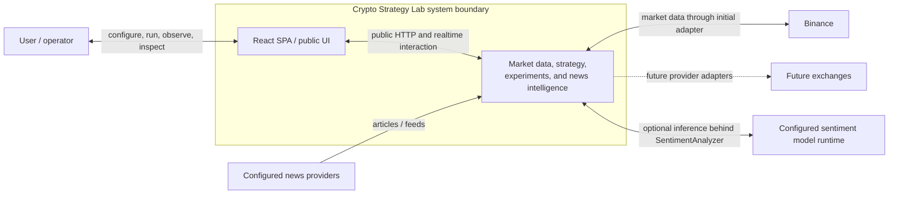

# System Context

## Purpose

This view places Crypto Strategy Lab between its user-facing React UI and the external data/model systems it depends on. It deliberately stays above process, queue, database, and module details.

## Diagram

## Notes

- Binance is the initial exchange; future exchanges enter only through provider adapters.
- The model runtime may be local, hosted, Node-compatible, or Python-backed behind the same port.
- Real order execution, custody, exchange accounts, and public multi-tenancy are outside baseline v1.2.

## References

- [Baseline - System boundaries](../architecture/architecture-baseline.md#system-boundaries)
- [Proposal section 15 - System Context](../architecture/architecture-proposal.md#15-system-context)
- [ADR-003 - Provider adapters](../adr/ADR-003-provider-adapters.md)
- [ADR-007 - News and sentiment isolation](../adr/ADR-007-news-sentiment-isolation.md)
