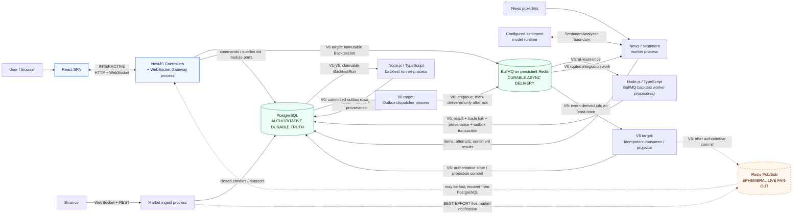

# Container / Runtime View

## Purpose

This view shows the runtime roles and the semantics of their communication paths. It separates interactive traffic, durable asynchronous delivery, authoritative storage, and best-effort live notification.

## Diagram

## Notes

- Logical modules share one codebase; these role processes are not independently owned microservices.
- The API-to-PostgreSQL edge collapses in-process module calls for runtime readability; `ARC-API` does not access another module's repositories or tables directly.
- V1 through V5 use the PostgreSQL-backed durable executor authorized by ADR-010;
  the runner is a separate process and PostgreSQL owns claim/recovery state.
- BullMQ/Redis is the mandatory V6 correctness delivery path and requires
  persistence/no-arbitrary-eviction configuration.
- **Every edge and node marked `V6` is target architecture and is not implemented.**
  That includes BullMQ, the BullMQ worker processes, the outbox dispatcher, and the
  idempotent consumer/projector. The realized topology is the unmarked edges plus the
  `V1-V5` runner path. See [`docs/final-defense-notes.md`](../final-defense-notes.md).
- Redis Pub/Sub never proves durable delivery; PostgreSQL snapshots and projections are recovery truth.

## References

- [Baseline - Runtime communication](../architecture/architecture-baseline.md#runtime-communication)
- [Baseline - Deployment topology](../architecture/architecture-baseline.md#deployment-topology)
- [ADR-001 - Process-role separation](../adr/ADR-001-modular-monolith-process-roles.md)
- [ADR-004 - Asynchronous experiment processing](../adr/ADR-004-asynchronous-experiment-processing.md)
- [ADR-005 - Transactional results](../adr/ADR-005-transactional-results-leaderboard.md)
- [ADR-008 - Realtime delivery](../adr/ADR-008-realtime-delivery-recovery.md)
- [ADR-009 - Technology realization](../adr/ADR-009-technology-realization.md)
- [ADR-010 - Asynchronous execution sequencing](../adr/ADR-010-realization-sequencing-for-asynchronous-backtest-execution.md)
