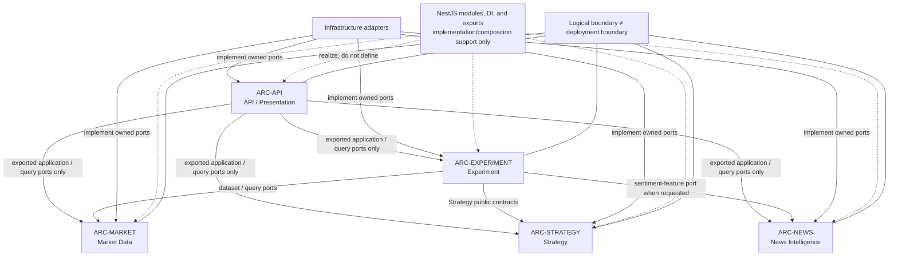

# Module Boundaries and Dependency Directions

## Purpose

This view shows the five logical architecture modules and the only permitted cross-module dependency directions. Dependencies target exported application/domain ports, never another module's implementation details.

## Diagram

## Notes

- NestJS mapping: `ApiModule`, `MarketModule`, `StrategyModule`, `ExperimentModule`, and `NewsModule` support the corresponding frozen `ARC-*` boundaries.
- Shared/common code is limited to technical primitives and versioned integration schemas.
- The diagram omits internal components and data ownership details; the baseline remains authoritative.

Forbidden examples:

| Not allowed | Boundary violated |
|---|---|
| Import another module's repository, adapter, ORM repository/model, or private provider | Public-port-only cross-module access |
| Strategy calls a provider or persistence directly | Framework- and infrastructure-independent strategy domain |
| A worker directly mutates the leaderboard | Experiment-owned, event-driven `LeaderboardProjector` |

## References

- [Baseline - Logical modules / bounded contexts](../architecture/architecture-baseline.md#logical-modules--bounded-contexts)
- [Baseline - Allowed dependency directions](../architecture/architecture-baseline.md#allowed-dependency-directions)
- [Baseline - NestJS realization invariants](../architecture/architecture-baseline.md#nestjs-realization-invariants)
- [ADR-001 - Modular monolith](../adr/ADR-001-modular-monolith-process-roles.md)
- [ADR-002 - Strategy and search contracts](../adr/ADR-002-strategy-and-search-contracts.md)
- [ADR-003 - Provider adapters](../adr/ADR-003-provider-adapters.md)
- [ADR-007 - News and sentiment isolation](../adr/ADR-007-news-sentiment-isolation.md)
- [ADR-009 - Technology realization](../adr/ADR-009-technology-realization.md)
