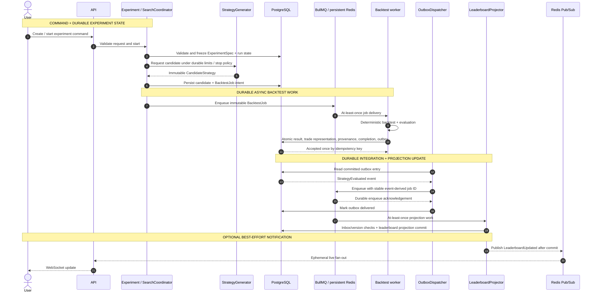

# Experiment / Backtest Runtime Flow

## Purpose

This sequence follows an experiment from the user's command through immutable specification, durable work, authoritative result acceptance, leaderboard projection, and optional UI notification. It highlights the two at-least-once queue stages and their PostgreSQL consistency boundaries.

## Diagram

## Notes

- Pause, resume, cancel, and stop remain durable Experiment state; broker cancellation does not define domain state.
- The accepted trade representation is either direct rows or an immutable reference plus content hash.
- The worker never mutates the leaderboard; Pub/Sub loss cannot lose the committed result or projection.

## References

- [Baseline - Runtime communication](../architecture/architecture-baseline.md#runtime-communication)
- [Baseline - Persistence rules](../architecture/architecture-baseline.md#persistence-rules)
- [Proposal section 18.3 - Search to rank flow](../architecture/architecture-proposal.md#183-search---backtest---evaluate---rank-flow)
- [ADR-004 - Asynchronous experiment processing](../adr/ADR-004-asynchronous-experiment-processing.md)
- [ADR-005 - Transactional results and leaderboard](../adr/ADR-005-transactional-results-leaderboard.md)
- [ADR-006 - Immutable experiment provenance](../adr/ADR-006-immutable-experiment-provenance.md)
