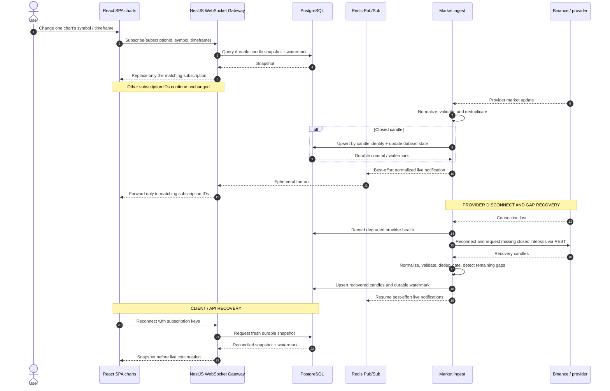

# Realtime Market Flow

## Purpose

This sequence separates low-latency chart delivery from closed-candle correctness. Market Data owns normalization, deduplication, gap recovery, and durable candle state; the UI owns only independent subscriptions and presentation.

## Diagram

## Notes

- PostgreSQL candle/dataset state—not Pub/Sub—is the durable source of truth.
- Closed-candle correctness, provider health, reconnect, and gap repair belong to `ARC-MARKET`, never the UI.
- In-progress live notifications may be lost; reconnect restores a durable snapshot before live continuation.

## References

- [Baseline - ARC-MARKET](../architecture/architecture-baseline.md#arc-market---market-data)
- [Baseline - Runtime communication](../architecture/architecture-baseline.md#runtime-communication)
- [Baseline - Events](../architecture/architecture-baseline.md#events)
- [Proposal section 18.1 - Realtime market-data flow](../architecture/architecture-proposal.md#181-realtime-market-data-flow)
- [ADR-003 - Provider adapters](../adr/ADR-003-provider-adapters.md)
- [ADR-008 - Realtime delivery and recovery](../adr/ADR-008-realtime-delivery-recovery.md)
- [ADR-009 - Technology realization](../adr/ADR-009-technology-realization.md)
