# News / Sentiment Flow

## Purpose

This view shows collection and inference as isolated stages joined by normalized contracts and durable work. Strategy and Experiment consume only a versioned sentiment feature; they never see provider, model, language, or runtime internals.

## Diagram

```mermaid
flowchart LR
    Sources["Configured news sources"] --> Provider["NewsProvider port<br/>+ source adapter"]
    Provider --> Collector["Collector"]
    Collector --> Normalize["Normalize + deduplicate"]
    Normalize --> Item["Normalized NewsItem"]
    Item -->|"item + source provenance + outbox"| DB[("PostgreSQL")]

    DB -->|"committed NewsCollected outbox"| Dispatcher["Outbox dispatcher"]
    Dispatcher -->|"durable enqueue acknowledgement"| Queue[("BullMQ sentiment queue")]
    Queue -->|"at-least-once"| Worker["News / sentiment worker"]
    Worker --> Analyzer["SentimentAnalyzer port"]
    Analyzer --> Impl["Configured implementation<br/>Node-compatible, hosted, or optional Python-backed"]
    Impl --> Result["Versioned SentimentResult"]
    Result -->|"result + attempt/model/input provenance + outbox"| DB

    DB --> Feature["Sentiment-feature query"]
    Feature -->|"normalized SentimentFeature"| Experiment["ARC-EXPERIMENT<br/>context assembly"]
    Experiment -->|"supplied analysis context only"| Strategy["ARC-STRATEGY"]

    Provider -.-> NewsFailure["Provider/collector failure<br/>record health; isolate from charts and technical backtests"]
    Impl -.-> ModelFailure["Model failure<br/>record attempts/retries; degrade only sentiment-dependent work"]

    classDef failure fill:#fff7ed,stroke:#c2410c,color:#431407,stroke-dasharray: 5 5;
    class NewsFailure,ModelFailure failure;
```

## Notes

- Collector failure does not invoke the model path; model failure does not discard the normalized item.
- Python is optional only as an adapter/runtime behind the framework-independent `SentimentAnalyzer` port.
- Missing or stale sentiment behavior is an explicit policy for sentiment-dependent candidates; technical experiments remain independent.

## References

- [Baseline - ARC-NEWS](../architecture/architecture-baseline.md#arc-news---news-intelligence)
- [Baseline - Runtime communication](../architecture/architecture-baseline.md#runtime-communication)
- [Proposal section 18.5 - News to sentiment flow](../architecture/architecture-proposal.md#185-news---sentiment-flow)
- [ADR-007 - News collection and sentiment isolation](../adr/ADR-007-news-sentiment-isolation.md)
- [ADR-009 - Technology realization](../adr/ADR-009-technology-realization.md)
