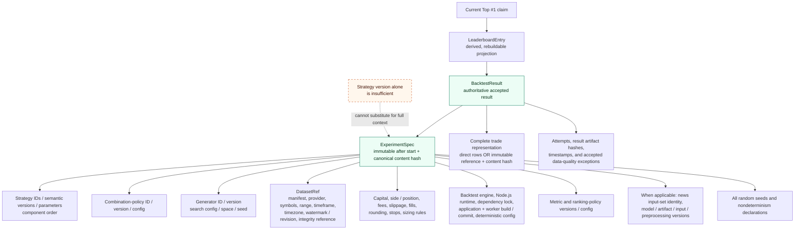

# Reproducibility / Provenance Map

## Purpose

This map traces a leaderboard position back through the accepted result to the complete immutable experiment context. A Top #1 result is reproducible only when every applicable branch resolves to a fixed value, version, identity, or content hash.

## Diagram

## Notes

- The leaderboard is never reconstructed as source truth; it links to the result and immutable specification.
- Historical reruns never resolve fields from current defaults, latest aliases, or mutable provider data.
- Deterministic reruns compare canonical trade/metric artifacts; declared nondeterminism uses the recorded tolerance.

## References

- [Baseline - Reproducibility rules](../architecture/architecture-baseline.md#reproducibility-rules)
- [Baseline - Persistence rules](../architecture/architecture-baseline.md#persistence-rules)
- [Proposal section 21 - Reproducibility model](../architecture/architecture-proposal.md#21-reproducibility-model)
- [ADR-005 - Transactional results and leaderboard](../adr/ADR-005-transactional-results-leaderboard.md)
- [ADR-006 - Immutable experiment specification](../adr/ADR-006-immutable-experiment-provenance.md)
- [PROOF-REP-001](../validation/architecture-proof-plan.md#proof-rep-001---leaderboard-reproducibility)
