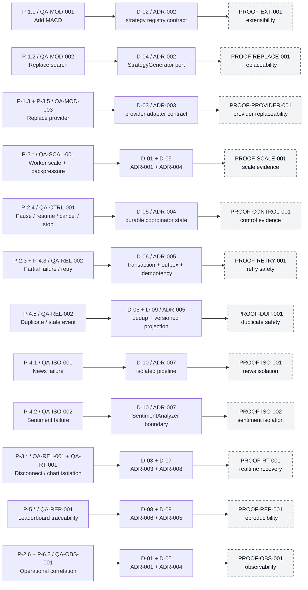

# Proof Coverage Map

## Purpose

This map connects architecture problems and quality scenarios to their accepted decisions and planned implementation proofs. These are proof obligations, not completed evidence; the baseline remains `PENDING IMPLEMENTATION PROOFS`.

## Diagram

## Notes

- Dashed proof nodes indicate planned evidence; none of these proofs is complete yet.
- Each proof records environment, build/configuration, fixture identity, commands, telemetry, result, and artifact hashes.
- A failed proof triggers the baseline deviation procedure; it does not authorize a silent diagram or architecture change.

## References

- [Architecture Proof Plan](../validation/architecture-proof-plan.md)
- [Proposal - Quality Attribute Scenarios](../architecture/architecture-proposal.md#10-quality-attribute-scenarios)
- [Proposal - Candidate solution analysis](../architecture/architecture-proposal.md#12-candidate-solution-analysis)
- [Baseline - Accepted ADRs](../architecture/architecture-baseline.md#accepted-adrs)
