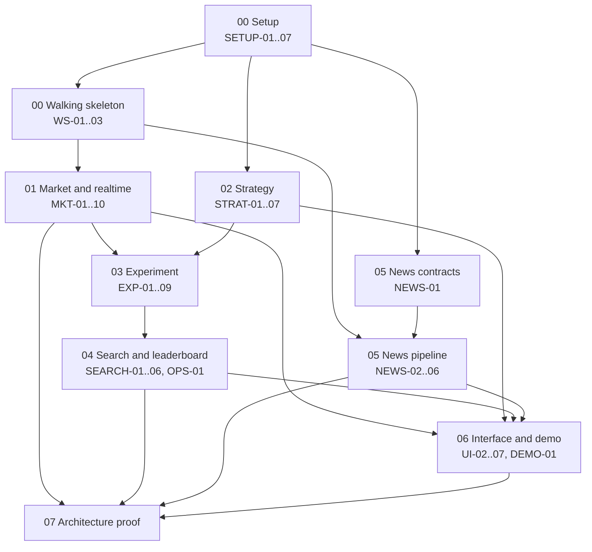

# Implementation Tracking

The one question this file answers: **what should the next coding session work on?**

Read [`README.md`](README.md) first for how to use this and what a coding agent may
change here.

**Last reviewed:** 2026-08-22, against an empty application tree (documentation
only, no `apps/`, no `packages/`, no lock file).

## Status vocabulary

| Status | Meaning |
|---|---|
| `TODO` | Defined, but at least one dependency slice is not `DONE`. Do not start. |
| `READY` | Every dependency is `DONE` and nothing external is blocking. Pick from here. |
| `IN_PROGRESS` | A session is working on it. Its unfinished state is in `.scratch/checkpoints/<slice-id>.md`. |
| `BLOCKED` | Something outside coding must happen first. The Blocker column says what. |
| `DONE` | Acceptance criteria met, validation run, diff reviewed. The Evidence column says where to look. |

`TODO` earns its place here because the plan has 56 slices. Without it, every
not-yet-startable slice would either read as `READY` (wrong, and a session would
start one) or as blank (which hides whether the slice was even considered).

## Rules

- Only mark a slice `READY` when every dependency is genuinely `DONE` **in the
  code**, not merely in this table. Check the tree before you trust the row.
- `BLOCKED` outranks `TODO`. A slice waiting on a human decision is shown as
  `BLOCKED` even if its dependencies are also unfinished, because the decision can
  be resolved in parallel and someone needs to see it.
- `BLOCKED` must always name the blocker.
- `DONE` should point at concrete evidence: a commit, a test command, a proof
  record. "It works" is not evidence.
- Keep one or at most a few slices `IN_PROGRESS`.
- No conversational detail here. Unfinished inner-task state belongs in
  `.scratch/checkpoints/`.
- Statuses reflect reality, not intent. Architecture documents existing is not
  implementation progress.

## Current state

Nothing is implemented. One slice is `READY`.

| | Count |
|---|---|
| Implementation slices | 56 |
| `DONE` | 0 |
| `IN_PROGRESS` | 0 |
| `READY` | 1 (`SETUP-01`) |
| `BLOCKED` | 4 (all on decisions listed in [`00-setup-and-walking-skeleton.md`](00-setup-and-walking-skeleton.md)) |
| `TODO` | 51 |
| Proof runs | 12, none run |

**Start here:** `SETUP-01`.

## Area dependency shape



Areas 01 (market), 02 (strategy), and the first half of 05 (news contracts) are
independent of each other once the walking skeleton exists. That is the main
opportunity to run sessions in parallel.

## Critical chain

The longest dependency path, and therefore the one that decides how soon a full
demo is possible:

```text
SETUP-01 -> SETUP-02 -> SETUP-03 -> SETUP-04 -> SETUP-05 -> WS-01
  -> MKT-01 -> MKT-02 -> MKT-03 -> MKT-10
    -> EXP-01 -> EXP-02 -> EXP-03 -> EXP-05 -> EXP-06 -> EXP-08 -> EXP-09
      -> SEARCH-04 -> SEARCH-05 -> UI-04 -> UI-05 -> UI-06 -> DEMO-01
```

Twenty-three slices. Anything not on this chain can wait; anything on it should not.

## What can run in parallel

Once `WS-01` is `DONE`, three chains are independent and can be worked by separate
sessions:

| Chain | Slices | Note |
|---|---|---|
| Market and realtime | `MKT-01` onward | On the critical chain. Give it the first session. |
| Strategy | `STRAT-01` onward | Needs only `SETUP-05`, so it can in fact start before `WS-01`. |
| News contracts | `NEWS-01` onward | Needs only `SETUP-05`. `NEWS-02` then needs `WS-02`. |

Later parallel pairs that do not touch each other:

- `MKT-09` (gap recovery) and `MKT-10` (dataset identity) after `MKT-06`.
- `EXP-07` (provenance) and `EXP-08` (dispatcher) after `EXP-06`.
- `SEARCH-01` and `SEARCH-02` (control) alongside `EXP-07` and `EXP-08`.
- `UI-02` (Strategy Engine page) alongside anything in area 03, once `STRAT-05` is
  done.
- `UI-07` (News page) alongside anything in area 04, once `NEWS-05` is done.

Two sessions must not take `EXP-06`, `EXP-08`, and `EXP-09` at the same time. They
share the same transaction and event path, and concurrent edits there are how the
correctness rules get quietly broken.

---

## 00 - Setup and walking skeleton

Plan file: [`00-setup-and-walking-skeleton.md`](00-setup-and-walking-skeleton.md)

| ID | Slice | Status | Depends on | Unblocks | Blocker | Evidence |
|---|---|---|---|---|---|---|
| SETUP-01 | Workspace, TypeScript, quality commands | READY | - | 3 | | |
| SETUP-02 | Local infrastructure and configuration | TODO | SETUP-01 | 2 | | |
| SETUP-03 | NestJS API process and module skeleton | TODO | SETUP-01, SETUP-02 | 4 | | |
| SETUP-04 | Migrations and module-owned schemas | TODO | SETUP-02, SETUP-03 | 3 | | |
| SETUP-05 | Architecture boundary tests | TODO | SETUP-03, SETUP-04 | 3 | | |
| SETUP-06 | React SPA workspace and shell | TODO | SETUP-01, SETUP-03 | 5 | | |
| SETUP-07 | Correlation identifiers and logging | TODO | SETUP-03 | 1 | | |
| WS-01 | Skeleton: SPA to HTTP to port to PostgreSQL | TODO | SETUP-04, SETUP-05, SETUP-06 | 2 | | |
| WS-02 | Skeleton: BullMQ round trip in a worker process | TODO | WS-01, SETUP-07 | 3 | | |
| WS-03 | Skeleton: WebSocket gateway and Pub/Sub fan-out | TODO | WS-02 | 1 | | |

## 01 - Market data and realtime

Plan file: [`01-market-and-realtime.md`](01-market-and-realtime.md)

| ID | Slice | Status | Depends on | Unblocks | Blocker | Evidence |
|---|---|---|---|---|---|---|
| MKT-01 | Candle contract, provider port, contract suite | TODO | WS-01 | 1 | | |
| MKT-02 | Binance historical adapter | TODO | MKT-01 | 2 | | |
| MKT-03 | Candle persistence and query port | TODO | MKT-02, SETUP-04 | 3 | | |
| MKT-04 | Candle history endpoint | TODO | MKT-03 | 1 | | |
| MKT-05 | Single candlestick chart | TODO | MKT-04, SETUP-06 | 2 | | |
| MKT-06 | Binance live ingest process | TODO | MKT-03, WS-03 | 2 | | |
| MKT-07 | Chart subscription protocol | TODO | MKT-06, MKT-05 | 2 | | |
| MKT-08 | Four independent charts and timeframes | TODO | MKT-07 | 1 | | |
| MKT-09 | Gap detection, recovery, provider health | TODO | MKT-06, MKT-02 | 1 | | |
| MKT-10 | Dataset identity and manifest | TODO | MKT-03 | 1 | | |

## 02 - Strategy and composition

Plan file: [`02-strategy-and-composition.md`](02-strategy-and-composition.md)

| ID | Slice | Status | Depends on | Unblocks | Blocker | Evidence |
|---|---|---|---|---|---|---|
| STRAT-01 | Strategy contract, descriptor, registry | TODO | SETUP-05 | 1 | | |
| STRAT-02 | Indicator primitives and the first strategy | TODO | STRAT-01 | 1 | | |
| STRAT-03 | The remaining three MVP strategies | TODO | STRAT-02 | 3 | | |
| STRAT-04 | Composite strategy and combination policy | TODO | STRAT-03 | 4 | | |
| STRAT-05 | Strategy catalog query and endpoint | TODO | STRAT-03, SETUP-06 | 1 | | |
| STRAT-06 | Candidate contract and canonical hashing | TODO | STRAT-04 | 2 | | |
| STRAT-07 | Generator port and random search generator | TODO | STRAT-06 | 2 | | |

## 03 - Experiment, backtest, evaluation

Plan file: [`03-experiment-backtest-evaluation.md`](03-experiment-backtest-evaluation.md)

| ID | Slice | Status | Depends on | Unblocks | Blocker | Evidence |
|---|---|---|---|---|---|---|
| EXP-01 | Immutable experiment specification | TODO | MKT-10, STRAT-06 | 2 | | |
| EXP-02 | Deterministic backtester | BLOCKED | EXP-01, STRAT-04 | 1 | Execution model defaults (capital, fee, slippage, fill, rounding, sizing, stops) not supplied | |
| EXP-03 | Evaluator and the MVP metric set | TODO | EXP-02 | 2 | | |
| EXP-04 | Candidate and job persistence with dispatch | TODO | EXP-01, STRAT-07, WS-02 | 1 | | |
| EXP-05 | Backtest worker | TODO | EXP-04, EXP-03 | 2 | | |
| EXP-06 | Result acceptance transaction | TODO | EXP-05 | 3 | | |
| EXP-07 | Provenance capture | TODO | EXP-06 | 1 | | |
| EXP-08 | Outbox dispatcher | TODO | EXP-06 | 2 | | |
| EXP-09 | Idempotent consumer and inbox | TODO | EXP-08 | 1 | | |

## 04 - Search, leaderboard, observability

Plan file: [`04-search-and-leaderboard.md`](04-search-and-leaderboard.md)

| ID | Slice | Status | Depends on | Unblocks | Blocker | Evidence |
|---|---|---|---|---|---|---|
| SEARCH-01 | Search coordinator and stop conditions | TODO | EXP-05, STRAT-07 | 1 | | |
| SEARCH-02 | Pause, resume, cancel, reconciliation | TODO | SEARCH-01 | 1 | | |
| SEARCH-03 | Versioned ranking policy | BLOCKED | EXP-03 | 1 | Ranking weights and tie-break rule not supplied | |
| SEARCH-04 | Leaderboard projection | TODO | EXP-09, SEARCH-03 | 3 | | |
| SEARCH-05 | Experiment and leaderboard query surface | TODO | SEARCH-04, EXP-07 | 2 | | |
| SEARCH-06 | Live progress and leaderboard push | TODO | SEARCH-04, MKT-07 | 1 | | |
| OPS-01 | Operational status surface | TODO | SEARCH-04, EXP-08, MKT-09 | 0 | | |

## 05 - News and sentiment

Plan file: [`05-news-and-sentiment.md`](05-news-and-sentiment.md)

| ID | Slice | Status | Depends on | Unblocks | Blocker | Evidence |
|---|---|---|---|---|---|---|
| NEWS-01 | News contract, provider port, contract suite | TODO | SETUP-05 | 1 | | |
| NEWS-02 | Collection worker and first provider adapter | BLOCKED | NEWS-01, WS-02 | 1 | Concrete news sources not approved; licensing and rate policy unreviewed | |
| NEWS-03 | Analyzer port, result contract, lifecycle | TODO | NEWS-02 | 1 | | |
| NEWS-04 | First real sentiment analyzer | BLOCKED | NEWS-03 | 1 | Sentiment model or service not chosen | |
| NEWS-05 | Sentiment feature query and degradation policy | TODO | NEWS-04 | 2 | | |
| NEWS-06 | Sentiment strategy (optional extension) | TODO | NEWS-05, STRAT-04 | 0 | | |

## 06 - Interface pages and demo

Plan file: [`06-ui-and-demo-integration.md`](06-ui-and-demo-integration.md)

| ID | Slice | Status | Depends on | Unblocks | Blocker | Evidence |
|---|---|---|---|---|---|---|
| UI-02 | Strategy Engine page | TODO | STRAT-05, STRAT-04, SETUP-06 | 0 | | |
| UI-03 | Discovery page | TODO | SEARCH-06, SEARCH-05, SEARCH-02 | 1 | | |
| UI-04 | Backtest page with metrics and trades | TODO | SEARCH-05, EXP-06 | 1 | | |
| UI-05 | Signal and trade visualization | TODO | UI-04, MKT-05, STRAT-03 | 1 | | |
| UI-06 | Trade detail and chart highlight | TODO | UI-05 | 1 | | |
| UI-07 | News page | TODO | NEWS-05, SETUP-06 | 1 | | |
| DEMO-01 | End-to-end demo path and run documentation | TODO | UI-03, UI-06, UI-07, MKT-08 | 0 | | |

The Realtime page is not listed here. It is built by `MKT-05` and `MKT-08` as part
of the market vertical slice. There is no `UI-01`: the application shell is
`SETUP-06`.

## 07 - Architecture proof runs

Plan file: [`07-architecture-proof.md`](07-architecture-proof.md), definitions in
[`docs/validation/architecture-proof-plan.md`](../docs/validation/architecture-proof-plan.md).

Proof runs are not implementation slices. They are executed deliberately once their
prerequisites are `DONE`, and they produce an evidence record rather than a feature.

| ID | Proof | Status | Prerequisites | Evidence |
|---|---|---|---|---|
| PROOF-EXT-001 | Strategy extensibility | TODO | SETUP-05, STRAT-01, STRAT-03, STRAT-05, EXP-03, EXP-06, UI-02 | |
| PROOF-REPLACE-001 | Search replaceability | TODO | STRAT-06, STRAT-07, SEARCH-01, SEARCH-04, UI-03 | |
| PROOF-PROVIDER-001 | Provider replaceability | TODO | MKT-01, MKT-02, MKT-03, MKT-04, MKT-05 | |
| PROOF-SCALE-001 | Worker scale and backpressure | TODO | WS-02, EXP-04, EXP-05, EXP-06, SEARCH-01, OPS-01 | |
| PROOF-CONTROL-001 | Pause, resume, cancel, stop | TODO | SEARCH-01, SEARCH-02, EXP-05, UI-03 | |
| PROOF-RETRY-001 | Partial failure retry | TODO | EXP-06, EXP-08, EXP-09, SEARCH-04 | |
| PROOF-DUP-001 | Duplicate and stale event | TODO | EXP-08, EXP-09, SEARCH-04 | |
| PROOF-ISO-001 | News failure isolation | TODO | NEWS-02, MKT-08, EXP-05, UI-07 | |
| PROOF-ISO-002 | Sentiment failure isolation | TODO | NEWS-03, NEWS-04, NEWS-05, UI-07 | |
| PROOF-RT-001 | Realtime recovery and chart isolation | TODO | MKT-06, MKT-07, MKT-08, MKT-09 | |
| PROOF-REP-001 | Leaderboard reproducibility | TODO | MKT-10, EXP-01, EXP-02, EXP-07, SEARCH-03, SEARCH-04, SEARCH-05 | |
| PROOF-OBS-001 | Operational observability | TODO | SETUP-07, OPS-01, plus the proof it accompanies | |

Advancing the repository's validation status from `PENDING IMPLEMENTATION PROOFS`
is an architecture-level change to the frozen baseline's metadata. It requires the
proof evidence **and** explicit user approval. A coding agent never changes it.
